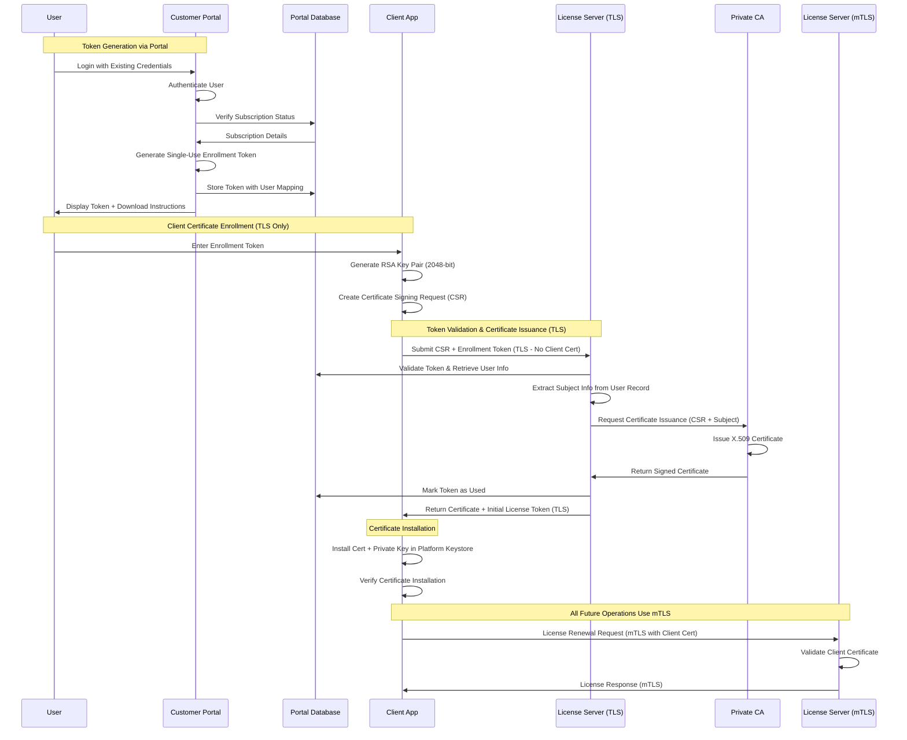
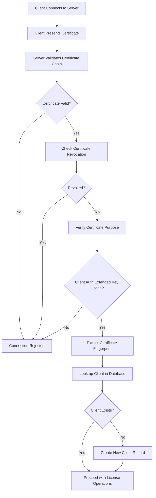
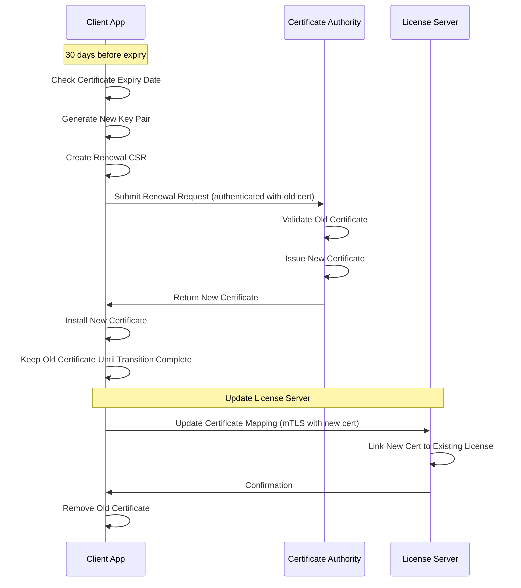
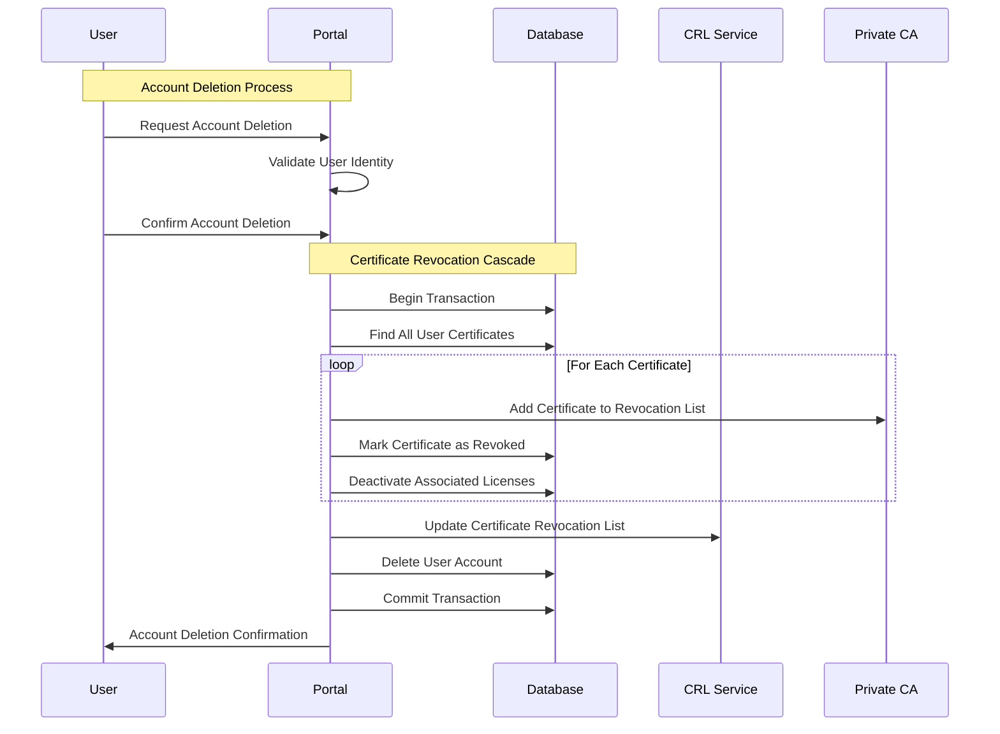
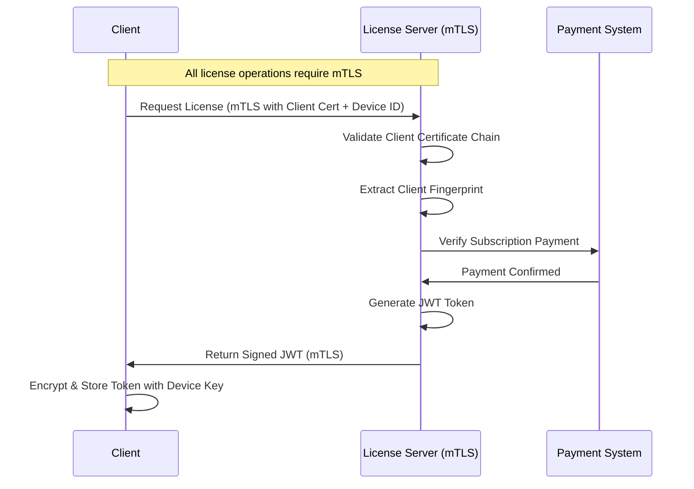
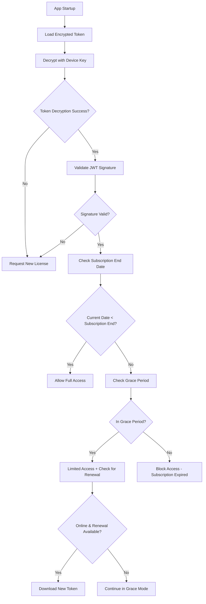
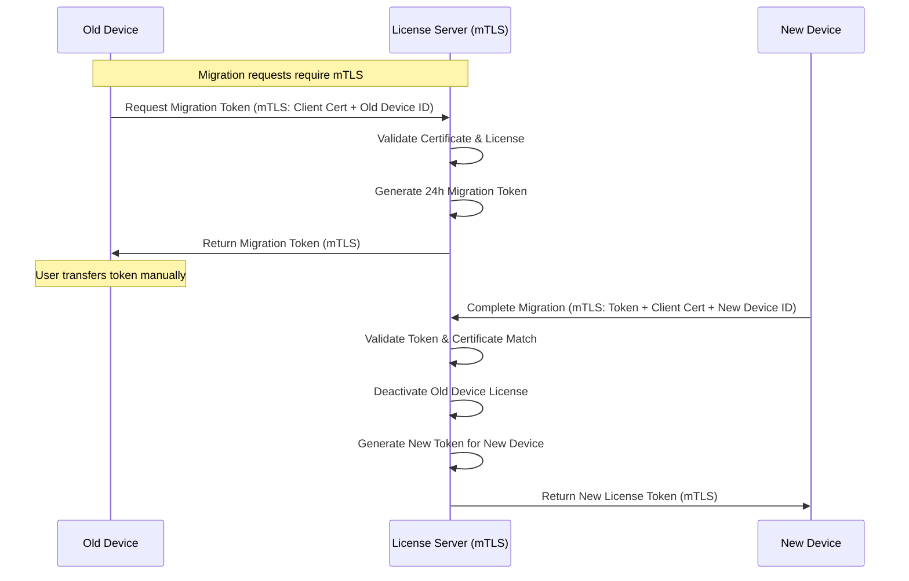

# Subscription Licensing System with Certificate Authentication - Design Document

## Table of Contents
1. [Executive Summary](#1-executive-summary)
2. [System Architecture](#2-system-architecture)
3. [Security Model](#3-security-model)
4. [Client Certificate Workflows](#4-client-certificate-workflows)
5. [Device Identification](#5-device-identification)
6. [License Management Workflow](#6-license-management-workflow)
7. [License Migration System](#7-license-migration-system)
8. [Server Implementation (PHP)](#8-server-implementation-php)
9. [Client Implementation](#9-client-implementation)
10. [Security Considerations](#10-security-considerations)
11. [Operational Considerations](#11-operational-considerations)
12. [Future Enhancements](#12-future-enhancements)

---

## 1. Executive Summary

This document outlines the design for a subscription-based license management system that enables clients to operate offline for extended periods while maintaining security through certificate-based authentication and preventing casual license sharing.

The system uses a two-layer security architecture:
- **Certificate Layer:** X.509 certificates from a Private CA provide cryptographic identity
- **License Layer:** JWT tokens provide subscription management and feature entitlements

### 1.1 Key Features

- **Dual-layer authentication**: Certificate identity + license authorization
- **Subscription-based licensing**: Monthly and annual subscription models
- **Extended offline operation**: Full subscription period offline capability
- **Grace period support**: 5 days for monthly, 14 days for annual subscriptions
- **Multi-platform support**: Windows, macOS, and Linux
- **License migration**: Secure device transfer for hardware upgrades
- **Private CA infrastructure**: Hierarchical certificate authority
- **Mutual authentication**: X.509 certificates for both client and server identity

### 1.2 Architecture Overview

```
┌─────────────────────────────────────────────────────────────┐
│                   Certificate Layer                         │
│        (Certificate Provisioning & mTLS)                    │
│                                                             │
│  ┌──────────────┐         ┌──────────────┐                  │
│  │ Private CA   │         │ Client Cert  │                  │
│  │ - Root CA    │────────►│ Provisioning │                  │
│  │ - Inter. CA  │         │ - Web Token  │                  │
│  └──────────────┘         └──────────────┘                  │
└─────────────────────────────────────────────────────────────┘
                              │
                              │ Authenticated mTLS Channel
                              ▼
┌─────────────────────────────────────────────────────────────┐
│                   License Layer                             │
│         (Subscription & License Management)                 │
│                                                             │
│  ┌──────────────┐         ┌──────────────┐                  │
│  │ JWT License  │         │ Subscription │                  │
│  │ Tokens       │◄────────│ Management   │                  │
│  │ - Device ID  │         │ - Grace      │                  │
│  │ - Offline    │         │ - Migration  │                  │
│  └──────────────┘         └──────────────┘                  │
└─────────────────────────────────────────────────────────────┘

Client App                      License Server
┌─────────────────┐            ┌─────────────────┐
│ Certificate     │            │ Certificate     │
│ - From CA       │◄──mTLS────►│ Validation      │
│                 │            │ (Private CA)    │
├─────────────────┤            ├─────────────────┤
│ License Token   │            │ License Token   │
│ - JWT Storage   │◄───────────│ Issuance        │
│ - Device Bound  │            │ (Signed by      │
│ - Offline Valid │            │  Server Key)    │
└─────────────────┘            └─────────────────┘
```

### 1.3 Key Integration Points

**Certificate Provisioning → License Issuance:**
1. User obtains enrollment token from web portal
2. Client generates CSR and submits via TLS with token
3. Private CA issues X.509 client certificate
4. Server immediately generates initial JWT license token
5. Client receives both certificate and license token together

**Ongoing Operations:**
1. Client uses mTLS with certificate for authentication
2. Server validates certificate AND license token status
3. License renewals delivered over mTLS channel
4. Client operates offline using cached license token

**Certificate Lifecycle → License Lifecycle:**
- Certificate valid for 2 years
- License token renewed monthly/annually
- Certificate renewal may trigger license token refresh
- Certificate revocation (account deletion) invalidates all license tokens

## 2. System Architecture

```
Client App                      License Server
┌─────────────────┐            ┌─────────────────┐
│ Certificate     │            │ Certificate     │
│ - From CA       │◄──mTLS────►│ Validation      │
│                 │            │ (Private CA)    │
├─────────────────┤            ├─────────────────┤
│ License Token   │            │ License Token   │
│ - JWT Storage   │◄───────────│ Issuance        │
│ - Device Bound  │            │ (Signed by      │
│ - Offline Valid │            │  Server Key)    │
└─────────────────┘            └─────────────────┘
```

## 3. Security Model

### 3.1 Layered Authentication Architecture

**Layer 1 - Certificate-Based Identity:**
- X.509 client certificates issued by Private CA
- Hierarchical CA: Root CA (offline) → Intermediate CA (online) → Client Certs
- Certificate validity: 2 years
- mTLS provides cryptographic authentication

**Layer 2 - License Token Authorization:**
- JWT tokens signed by server private key
- Contains subscription and entitlement information
- Device-bound for offline validation
- Shorter validity aligned with subscription periods (monthly/annual)

**Why Both Layers?**
- **Certificate Layer:** Proves client identity and authenticity
- **License Layer:** Proves subscription status and entitlements
- **Together:** Certificate authenticates WHO (identity), License authorizes WHAT (permissions)

### 3.2 Two-Phase Authentication Model

**Phase 1 - Certificate Enrollment (TLS Only):**
- Initial CSR submission uses standard TLS
- Client cannot use mTLS since they don't have a certificate yet
- Authentication relies on enrollment token validation
- Server validates enrollment token and issues certificate

**Phase 2 - License Operations (mTLS):**
- All subsequent operations require mutual TLS authentication
- Client presents X.509 certificate for authentication
- Server validates client certificate chain and identity
- Bidirectional authentication for all license management

**Client Authentication:**
- X.509 client certificates issued by private CA
- Certificate fingerprint used as primary client identifier
- Private key possession required for all license operations (post-enrollment)

**Server Authentication:**
- X.509 server certificate issued by public CA
- Client validates server certificate during TLS handshake

### 3.3 License Token Format

**JWT Structure with Certificate Integration:**
```json
{
  "sub": "client-cert-fingerprint-sha256",
  "cert_serial": "certificate-serial-number",
  "device_id": "platform-specific-device-id", 
  "subscription_type": "monthly|annual",
  "subscription_id": "database-subscription-id",
  "subscription_end": 1640995200,
  "grace_period_end": 1641427200,
  "entitlements": {
    "features": ["premium", "analytics"],
    "max_users": 100
  },
  "payment_status": "active",
  "iat": 1640995200,
  "iss": "license-server.com"
}
```

**Certificate-License Binding:**
- `sub` field contains client certificate fingerprint
- `cert_serial` references the certificate serial number from CA database
- License token is cryptographically bound to specific certificate
- Server validates both certificate AND token on every request

**Token Security:**
- Signed with server's RSA private key (separate from CA keys)
- Client validates using embedded server public key
- Device-specific encryption using hardware keystore
- Cannot be decrypted on different devices

## 4. Client Certificate Workflows

### 4.1 Certificate Enrollment Process

**Portal-Based Token Distribution:**
The certificate enrollment process uses an existing customer portal for secure token generation, followed by a two-phase authentication model.



### 4.2 Customer Portal Integration

**Portal-Based Token Generation:**
```php
class PortalEnrollmentService {
    private $db;
    private $userSession;
    
    public function generateEnrollmentToken($userId) {
        // Verify user is authenticated and has valid subscription
        $user = $this->validateUserAccess($userId);
        
        // Check for existing unused tokens
        $existingToken = $this->getUnusedToken($userId);
        if ($existingToken) {
            throw new ExistingTokenException('You already have an unused enrollment token');
        }
        
        // Generate new token
        $token = $this->generateSecureToken();
        $expiresAt = new DateTime('+7 days');
        
        // Store token linked to user account
        $stmt = $this->db->prepare("
            INSERT INTO enrollment_tokens 
            (token, user_id, subscriber_email, subscriber_name, organization, 
             subscription_type, subscription_id, expires_at, max_uses, used_count, created_at) 
            VALUES (?, ?, ?, ?, ?, ?, ?, ?, 1, 0, NOW())
        ");
        
        $stmt->execute([
            $token,
            $user['id'],
            $user['email'],
            $user['full_name'],
            $user['organization'],
            $user['subscription_type'],
            $user['subscription_id'],
            $expiresAt->format('Y-m-d H:i:s')
        ]);
        
        // Log token generation for audit
        $this->auditLog->record('enrollment_token_generated', $userId, [
            'token_id' => $this->db->lastInsertId(),
            'subscription_id' => $user['subscription_id']
        ]);
        
        return [
            'token' => $token,
            'expires_at' => $expiresAt->format('c'),
            'instructions' => $this->getDownloadInstructions(),
            'subscription_type' => $user['subscription_type']
        ];
    }
    
    private function generateSecureToken() {
        return rtrim(strtr(base64_encode(random_bytes(32)), '+/', '-_'), '=');
    }
}
```

### 4.3 Enhanced Token Validation

**Server-Side Token Validation with User Context:**
```php
class EnrollmentTokenService {
    private $db;
    
    public function validateToken($token) {
        $stmt = $this->db->prepare("
            SELECT et.*, u.email, u.full_name, u.organization, 
                   s.subscription_type, s.end_date as subscription_end
            FROM enrollment_tokens et
            JOIN users u ON et.user_id = u.id
            JOIN subscriptions s ON et.subscription_id = s.id
            WHERE et.token = ? 
            AND et.expires_at > NOW() 
            AND et.used_count < et.max_uses
            AND s.status = 'active'
            AND s.end_date > NOW()
        ");
        
        $stmt->execute([$token]);
        $tokenRecord = $stmt->fetch(PDO::FETCH_ASSOC);
        
        if (!$tokenRecord) {
            throw new InvalidTokenException('Token is invalid, expired, or subscription inactive');
        }
        
        return $tokenRecord;
    }
    
    public function markTokenUsed($token, $certificateFingerprint) {
        $this->db->beginTransaction();
        
        try {
            $stmt = $this->db->prepare("
                UPDATE enrollment_tokens 
                SET used_count = used_count + 1, used_at = NOW(),
                    certificate_fingerprint = ?
                WHERE token = ?
            ");
            $stmt->execute([$certificateFingerprint, $token]);
            
            $this->auditLog->record('enrollment_token_used', null, [
                'token' => $token,
                'certificate_fingerprint' => $certificateFingerprint
            ]);
            
            $this->db->commit();
            
        } catch (Exception $e) {
            $this->db->rollback();
            throw $e;
        }
    }
}
```

### 4.4 Client-Side Enrollment Implementation

**Cross-Platform CSR Generation:**
```java
public class CertificateEnrollmentManager {
    
    public EnrollmentResult enrollWithToken(String enrollmentToken) {
        try {
            // Generate key pair
            KeyPairGenerator keyGen = KeyPairGenerator.getInstance("RSA");
            keyGen.initialize(2048);
            KeyPair keyPair = keyGen.generateKeyPair();
            
            // Create CSR
            X500Name subject = buildSubjectFromToken(enrollmentToken);
            PKCS10CertificationRequest csr = generateCSR(keyPair, subject);
            
            // Submit to server
            CertificateResponse response = submitEnrollmentRequest(enrollmentToken, csr);
            
            // Install certificate
            installCertificate(response.getCertificate(), keyPair.getPrivate());
            
            return EnrollmentResult.success(response.getCertificate());
            
        } catch (Exception e) {
            return EnrollmentResult.failure(e.getMessage());
        }
    }
    
    private PKCS10CertificationRequest generateCSR(KeyPair keyPair, X500Name subject) {
        PKCS10CertificationRequestBuilder builder = 
            new JcaPKCS10CertificationRequestBuilder(subject, keyPair.getPublic());
        
        // Add extensions
        ExtensionsGenerator extensionsGenerator = new ExtensionsGenerator();
        extensionsGenerator.addExtension(Extension.keyUsage, true, 
            new KeyUsage(KeyUsage.digitalSignature | KeyUsage.keyEncipherment));
        extensionsGenerator.addExtension(Extension.extendedKeyUsage, true,
            new ExtendedKeyUsage(KeyPurposeId.id_kp_clientAuth));
        
        builder.addAttribute(PKCSObjectIdentifiers.pkcs_9_at_extensionRequest,
            extensionsGenerator.generate());
        
        ContentSigner signer = new JcaContentSignerBuilder("SHA256withRSA")
            .build(keyPair.getPrivate());
        
        return builder.build(signer);
    }
}
```

### 4.5 Server-Side Certificate Issuance

**Integration with Private CA:**
```php
class CertificateEnrollmentController {
    private $tokenService;
    private $caService;
    private $licenseService;
    
    public function handleEnrollmentRequest($enrollmentToken, $csrPem) {
        try {
            // Validate enrollment token
            $tokenRecord = $this->tokenService->validateToken($enrollmentToken);
            
            // Parse and validate CSR
            $csr = $this->parseCSR($csrPem);
            $this->validateCSR($csr);
            
            // Build certificate subject from user info
            $subject = $this->buildCertificateSubject($tokenRecord);
            
            // Request certificate from Private CA
            $certificate = $this->caService->issueCertificate($csr, $subject, [
                'keyUsage' => 'digitalSignature,keyEncipherment',
                'extendedKeyUsage' => 'clientAuth',
                'validityPeriod' => '2 years'
            ]);
            
            $clientFingerprint = $this->extractCertificateFingerprint($certificate);
            $certSerial = $this->extractCertificateSerial($certificate);
            
            // Mark token as used
            $this->tokenService->markTokenUsed($enrollmentToken, $clientFingerprint);
            
            // Create client record
            $this->createClientRecord($clientFingerprint, $certSerial, $tokenRecord);
            
            // Generate initial JWT license token
            $deviceId = $_POST['device_id'] ?? '';
            $licenseToken = $this->licenseService->generateInitialLicense(
                $clientFingerprint,
                $certSerial,
                $deviceId,
                $tokenRecord
            );
            
            return [
                'certificate' => $certificate,
                'ca_chain' => $this->caService->getCertificateChain(),
                'license_token' => $licenseToken,
                'subscription_info' => [
                    'type' => $tokenRecord['subscription_type'],
                    'expires' => $tokenRecord['subscription_end']
                ]
            ];
            
        } catch (Exception $e) {
            throw new EnrollmentException('Certificate enrollment failed: ' . $e->getMessage());
        }
    }
    
    private function buildCertificateSubject($tokenRecord) {
        return sprintf(
            "CN=%s,OU=License Clients,O=%s",
            $tokenRecord['full_name'],
            $tokenRecord['organization'] ?? 'Licensed Users'
        );
    }
}
```

**Private CA Integration:**
```php
class PrivateCAService {
    private $caPrivateKey;
    private $caCertificate;
    private $config;
    
    public function issueCertificate($csr, $subject, $options = []) {
        // Create certificate from CSR
        $cert = new X509Certificate();
        $cert->setPublicKey($csr->getPublicKey());
        $cert->setSubject($subject);
        $cert->setIssuer($this->caCertificate->getSubject());
        
        // Set validity period (2 years)
        $validityYears = $options['validityPeriod'] ?? '2 years';
        $cert->setValidFrom(new DateTime());
        $cert->setValidTo(new DateTime('+' . $validityYears));
        
        // Add extensions
        $cert->addExtension('keyUsage', true, $options['keyUsage']);
        $cert->addExtension('extendedKeyUsage', true, $options['extendedKeyUsage']);
        $cert->addExtension('basicConstraints', true, 'CA:FALSE');
        
        // Add Authority Key Identifier
        $cert->addExtension('authorityKeyIdentifier', false, 
            $this->caCertificate->getSubjectKeyIdentifier());
        
        // Generate unique serial number
        $cert->setSerialNumber($this->generateSerialNumber());
        
        // Sign certificate with Intermediate CA key
        $cert->sign($this->caPrivateKey, 'sha256');
        
        // Store certificate in CA database
        $this->storeCertificate($cert);
        
        return $cert->toPEM();
    }
    
    public function getCertificateChain() {
        return [
            'root_ca' => file_get_contents($this->config['root_ca_path']),
            'intermediate_ca' => file_get_contents($this->config['intermediate_ca_path'])
        ];
    }
}
```

### 4.6 Certificate Storage and Security

**Platform-Specific Storage:**

**Windows:**
```java
public class WindowsCertificateManager {
    public void installCertificate(X509Certificate cert, PrivateKey privateKey) {
        KeyStore windowsStore = KeyStore.getInstance("Windows-MY");
        windowsStore.load(null, null);
        windowsStore.setKeyEntry("license-client-cert", privateKey, null, 
                                new Certificate[]{cert});
    }
    
    public X509Certificate getClientCertificate() {
        KeyStore windowsStore = KeyStore.getInstance("Windows-MY");
        windowsStore.load(null, null);
        return (X509Certificate) windowsStore.getCertificate("license-client-cert");
    }
}
```

**macOS:**
```java
public class MacOSCertificateManager {
    public void installCertificate(X509Certificate cert, PrivateKey privateKey) {
        // Use macOS Keychain Services
        // Private key stored with kSecAttrAccessibleWhenUnlockedThisDeviceOnly
        SecItemAdd(certificateAttributes);
        SecItemAdd(privateKeyAttributes);
    }
}
```

**Linux:**
```java
public class LinuxCertificateManager {
    public void installCertificate(X509Certificate cert, PrivateKey privateKey) {
        // Store in ~/.config/app-name/certificates/
        Files.write(Paths.get(certPath), cert.getEncoded());
        storeEncryptedPrivateKey(privateKey);
    }
}
```

### 4.7 Certificate Validation Workflow



### 4.8 Certificate Renewal Process



### 4.9 Certificate Revocation Handling

**Account-Driven Revocation:**
Certificate revocation occurs only when a user deletes their account from the customer portal.



**Portal Account Deletion Service:**
```php
class AccountDeletionService {
    private $db;
    private $caService;
    private $crlService;
    
    public function deleteUserAccount($userId, $userConfirmation) {
        $user = $this->validateUserDeletion($userId, $userConfirmation);
        
        $this->db->beginTransaction();
        
        try {
            // Find all certificates
            $certificates = $this->getUserCertificates($userId);
            
            // Revoke all certificates
            foreach ($certificates as $cert) {
                $this->revokeCertificate($cert, 'account_deletion');
            }
            
            // Deactivate all licenses
            $this->deactivateUserLicenses($userId);
            
            // Delete user data
            $this->deleteUserData($userId);
            
            // Update CRL
            $this->crlService->publishUpdatedCRL();
            
            $this->db->commit();
            
            return [
                'success' => true,
                'certificates_revoked' => count($certificates)
            ];
            
        } catch (Exception $e) {
            $this->db->rollback();
            throw $e;
        }
    }
    
    private function revokeCertificate($certificate, $reason) {
        $this->caService->revokeCertificate(
            $certificate['serial_number'], 
            $reason,
            new DateTime()
        );
        
        $stmt = $this->db->prepare("
            UPDATE issued_certificates 
            SET status = 'revoked', revoked_at = NOW(), revocation_reason = ?
            WHERE serial_number = ?
        ");
        $stmt->execute([$reason, $certificate['serial_number']]);
    }
}
```

## 5. Device Identification

### 5.1 Cross-Platform Device ID Strategy

**Hierarchical Approach (Most Stable First):**

**Windows:**
- Primary: `HKEY_LOCAL_MACHINE\SOFTWARE\Microsoft\Cryptography\MachineGuid`
- Fallback: Motherboard serial + CPU ID combination

**macOS:**
- Primary: Hardware UUID from `system_profiler SPHardwareDataType`
- Fallback: System serial number

**Linux:**
- Primary: `/etc/machine-id` or `/var/lib/dbus/machine-id`
- Fallback: DMI product UUID from `/sys/class/dmi/id/product_uuid`

### 5.2 Device ID Generation Logic

```java
public class DeviceIdentifier {
    
    public String generateDeviceId() {
        String deviceId = getMachineId();
        if (deviceId == null) deviceId = getHardwareFingerprint();
        if (deviceId == null) deviceId = generateFallbackId();
        
        return "device_" + sha256(deviceId);
    }
    
    private String getMachineId() {
        try {
            switch (getOperatingSystem()) {
                case WINDOWS:
                    return getWindowsMachineGuid();
                case MAC:
                    return getMacHardwareUUID();
                case LINUX:
                    return getLinuxMachineId();
                default:
                    return null;
            }
        } catch (Exception e) {
            return null;
        }
    }
    
    private String getWindowsMachineGuid() {
        return executeCommand("reg query HKEY_LOCAL_MACHINE\\SOFTWARE\\Microsoft\\Cryptography /v MachineGuid");
    }
    
    private String getMacHardwareUUID() {
        return executeCommand("system_profiler SPHardwareDataType | grep 'Hardware UUID'");
    }
    
    private String getLinuxMachineId() {
        String machineId = readFile("/etc/machine-id");
        if (machineId == null) {
            machineId = readFile("/var/lib/dbus/machine-id");
        }
        return machineId;
    }
}
```

## 6. License Management Workflow

### 6.1 Initial License Activation



### 6.2 Offline License Validation



### 6.3 Grace Period Behavior

**Monthly Subscriptions (5-day grace):**
- Days 1-5 after expiry: Full functionality with renewal attempts every 24 hours
- Background renewal checks every 6 hours when online
- Non-intrusive warnings about expired subscription

**Annual Subscriptions (14-day grace):**
- Days 1-14 after expiry: Full functionality with renewal attempts
- Less frequent renewal checks (daily) due to longer grace period
- Progressive warning escalation

## 7. License Migration System

### 7.1 Migration Workflow



### 7.2 Migration Security

**Token Characteristics:**
- Single-use migration tokens
- 24-hour expiration window
- Bound to specific client certificate
- Automatic cleanup after use or expiry

**User Experience:**
- Export: Generate migration code with clear instructions
- Import: Simple code entry on new device
- File-based transfer option for offline scenarios

## 8. Server Implementation (PHP)

### 8.1 Core Services

**Service Architecture:**

The server implementation integrates Private CA services with license management services.

**Certificate Management Services:**
- `PrivateCAService` - Issues certificates using Intermediate CA
- `EnrollmentTokenService` - Manages web portal tokens
- `CertificateValidator` - Validates client certificates via mTLS
- `CRLService` - Manages Certificate Revocation Lists

**License Management Services:**

**LicenseTokenService (mTLS Required):**
```php
class LicenseTokenService {
    private $serverPrivateKey;
    private $db;
    
    public function generateInitialLicense($clientCertFingerprint, $certSerial, $deviceId, $tokenRecord) {
        $subscription = $this->getSubscriptionDetails($tokenRecord['subscription_id']);
        
        return $this->generateLicenseToken(
            $clientCertFingerprint, 
            $certSerial,
            $deviceId, 
            $subscription
        );
    }
    
    public function generateLicenseToken($clientCertFingerprint, $certSerial, $deviceId, $subscription) {
        $header = json_encode(['typ' => 'JWT', 'alg' => 'RS256']);
        
        $subscriptionEnd = new DateTime($subscription['end_date']);
        $gracePeriodEnd = $this->calculateGracePeriodEnd($subscription['subscription_type'], $subscriptionEnd);
        
        $payload = json_encode([
            'sub' => $clientCertFingerprint,
            'cert_serial' => $certSerial,
            'device_id' => $deviceId,
            'subscription_type' => $subscription['subscription_type'],
            'subscription_id' => $subscription['id'],
            'subscription_end' => $subscriptionEnd->getTimestamp(),
            'grace_period_end' => $gracePeriodEnd->getTimestamp(),
            'entitlements' => $this->getEntitlements($subscription),
            'payment_status' => $subscription['payment_status'],
            'iat' => time(),
            'iss' => 'license-server.com'
        ]);
        
        $headerEncoded = $this->base64UrlEncode($header);
        $payloadEncoded = $this->base64UrlEncode($payload);
        
        $signature = '';
        openssl_sign(
            $headerEncoded . '.' . $payloadEncoded, 
            $signature, 
            $this->serverPrivateKey, 
            OPENSSL_ALGO_SHA256
        );
        
        $signatureEncoded = $this->base64UrlEncode($signature);
        
        return $headerEncoded . '.' . $payloadEncoded . '.' . $signatureEncoded;
    }
    
    private function calculateGracePeriodEnd($subscriptionType, $subscriptionEnd) {
        $graceDays = ($subscriptionType === 'monthly') ? 5 : 14;
        $graceEnd = clone $subscriptionEnd;
        $graceEnd->add(new DateInterval('P' . $graceDays . 'D'));
        return $graceEnd;
    }
}
```

**LicenseRenewalService (mTLS Required):**
```php
class LicenseRenewalService {
    private $db;
    private $tokenService;
    private $certificateValidator;
    
    public function checkForRenewal($clientCertFingerprint, $certSerial, $deviceId) {
        // Validate certificate is still valid
        if (!$this->certificateValidator->isCertificateActive($certSerial)) {
            throw new RevokedCertificateException('Certificate is no longer valid');
        }
        
        $subscription = $this->getSubscriptionStatus($clientCertFingerprint);
        
        if (!$subscription) {
            return [
                'status' => 'no_subscription',
                'message' => 'No subscription found'
            ];
        }
        
        $now = new DateTime();
        $subscriptionEnd = new DateTime($subscription['end_date']);
        $gracePeriodEnd = $this->calculateGracePeriodEnd($subscription['subscription_type'], $subscriptionEnd);
        
        if ($subscription['payment_status'] === 'active' && $subscriptionEnd > $now) {
            // Payment received - issue new token
            $newToken = $this->tokenService->generateLicenseToken(
                $clientCertFingerprint,
                $certSerial,
                $deviceId, 
                $subscription
            );
            
            $this->updateLicenseToken($clientCertFingerprint, $deviceId, $newToken);
            
            return [
                'status' => 'renewed',
                'token' => $newToken,
                'subscription_end' => $subscriptionEnd->format('c')
            ];
        }
        
        if ($now < $gracePeriodEnd) {
            return [
                'status' => 'grace_period',
                'grace_period_end' => $gracePeriodEnd->format('c'),
                'message' => 'Subscription expired, in grace period'
            ];
        }
        
        return [
            'status' => 'expired',
            'message' => 'Subscription has expired'
        ];
    }
}
```

**DeviceMigrationService (mTLS Required):**
```php
class DeviceMigrationService {
    private $db;
    private $tokenService;
    
    public function initiateLicenseMigration($clientCertFingerprint, $certSerial, $currentDeviceId) {
        $license = $this->findActiveLicense($clientCertFingerprint, $currentDeviceId);
        if (!$license) {
            throw new InvalidLicenseException('No valid license found for this device');
        }
        
        if ($license['cert_serial_number'] !== $certSerial) {
            throw new CertificateMismatchException('Certificate serial mismatch');
        }
        
        $migrationToken = $this->generateSecureToken();
        $expiresAt = new DateTime('+24 hours');
        
        $stmt = $this->db->prepare("
            INSERT INTO license_migrations 
            (migration_token, client_cert_fingerprint, cert_serial, 
             old_device_id, expires_at, created_at) 
            VALUES (?, ?, ?, ?, ?, NOW())
        ");
        
        $stmt->execute([
            $migrationToken,
            $clientCertFingerprint,
            $certSerial,
            $currentDeviceId,
            $expiresAt->format('Y-m-d H:i:s')
        ]);
        
        return [
            'migration_token' => $migrationToken,
            'expires_at' => $expiresAt->format('c'),
            'message' => 'Migration token valid for 24 hours'
        ];
    }
    
    public function completeLicenseMigration($migrationToken, $clientCertFingerprint, $certSerial, $newDeviceId) {
        $migration = $this->getMigrationRecord($migrationToken);
        
        if (!$migration || $migration['expires_at'] < new DateTime()) {
            throw new InvalidMigrationTokenException('Token is invalid or expired');
        }
        
        if ($migration['client_cert_fingerprint'] !== $clientCertFingerprint) {
            throw new CertificateMismatchException('Certificate mismatch');
        }
        
        if ($migration['cert_serial'] !== $certSerial) {
            throw new CertificateMismatchException('Certificate serial mismatch');
        }
        
        $this->db->beginTransaction();
        
        try {
            // Deactivate old device license
            $this->deactivateLicense($migration['old_device_id']);
            
            // Get active subscription
            $subscription = $this->getActiveSubscription($clientCertFingerprint);
            
            // Generate new license token for new device
            $newToken = $this->tokenService->generateLicenseToken(
                $clientCertFingerprint,
                $certSerial,
                $newDeviceId,
                $subscription
            );
            
            // Store new license
            $this->storeLicense($clientCertFingerprint, $certSerial, $newDeviceId, $subscription);
            
            // Clean up migration record
            $this->deleteMigrationRecord($migrationToken);
            
            $this->db->commit();
            
            return $newToken;
            
        } catch (Exception $e) {
            $this->db->rollback();
            throw $e;
        }
    }
}
```

### 8.2 Server Configuration Examples

**Apache/Nginx Configuration for Dual Authentication:**

**TLS-Only Endpoints (Certificate Enrollment):**
```nginx
# Enrollment endpoint - TLS only, no client certificate required
location /api/certificate/enroll {
    ssl_verify_client off;
    proxy_pass http://php-backend/enroll.php;
}

location /api/token/validate {
    ssl_verify_client off;
    proxy_pass http://php-backend/token-validate.php;
}
```

**mTLS Endpoints (All License Operations):**
```nginx
# License operations - require client certificate
location /api/license/ {
    ssl_verify_client on;
    ssl_client_certificate /path/to/ca-chain.pem;
    ssl_verify_depth 2;
    
    # Pass client certificate info to backend
    proxy_set_header SSL-Client-Cert $ssl_client_cert;
    proxy_set_header SSL-Client-Fingerprint $ssl_client_fingerprint;
    proxy_set_header SSL-Client-Verify $ssl_client_verify;
    
    proxy_pass http://php-backend/;
}

location /api/migration/ {
    ssl_verify_client on;
    ssl_client_certificate /path/to/ca-chain.pem;
    ssl_verify_depth 2;
    
    proxy_set_header SSL-Client-Cert $ssl_client_cert;
    proxy_set_header SSL-Client-Fingerprint $ssl_client_fingerprint;
    
    proxy_pass http://php-backend/;
}
```

**PHP Endpoint Authentication Validation:**
```php
// For mTLS endpoints - validate client certificate presence
function validateClientCertificate() {
    $clientCert = $_SERVER['SSL_CLIENT_CERT'] ?? null;
    $clientVerify = $_SERVER['SSL_CLIENT_VERIFY'] ?? null;
    
    if (!$clientCert || $clientVerify !== 'SUCCESS') {
        throw new AuthenticationException('Valid client certificate required');
    }
    
    return openssl_x509_fingerprint($clientCert, 'sha256');
}

// For TLS-only endpoints - validate enrollment token
function validateEnrollmentToken($token) {
    if (empty($token)) {
        throw new AuthenticationException('Enrollment token required');
    }
    
    return $this->tokenService->validateToken($token);
}
```

### 8.3 Database Schema

**Certificate and Enrollment Token Schema:**

```sql
-- Enrollment tokens for certificate provisioning
CREATE TABLE enrollment_tokens (
    id INT PRIMARY KEY AUTO_INCREMENT,
    token VARCHAR(255) UNIQUE NOT NULL,
    user_id INT NOT NULL,
    subscriber_email VARCHAR(255) NOT NULL,
    subscriber_name VARCHAR(255) NOT NULL,
    organization VARCHAR(255),
    subscription_type ENUM('monthly', 'annual') NOT NULL,
    subscription_id INT NOT NULL,
    expires_at DATETIME NOT NULL,
    max_uses INT DEFAULT 1,
    used_count INT DEFAULT 0,
    used_at TIMESTAMP NULL,
    certificate_fingerprint VARCHAR(255),
    revoked_at TIMESTAMP NULL,
    created_at TIMESTAMP DEFAULT CURRENT_TIMESTAMP,
    INDEX idx_token (token),
    INDEX idx_user_id (user_id),
    INDEX idx_expires (expires_at),
    INDEX idx_subscription_id (subscription_id),
    FOREIGN KEY (user_id) REFERENCES users(id),
    FOREIGN KEY (subscription_id) REFERENCES subscriptions(id)
);

-- Certificates issued by Private CA
CREATE TABLE issued_certificates (
    id INT PRIMARY KEY AUTO_INCREMENT,
    serial_number VARCHAR(255) UNIQUE NOT NULL,
    subject VARCHAR(500) NOT NULL,
    fingerprint VARCHAR(255) UNIQUE NOT NULL,
    client_cert_fingerprint VARCHAR(255),
    user_id INT NOT NULL,
    issued_at DATETIME NOT NULL,
    expires_at DATETIME NOT NULL,
    status ENUM('active', 'revoked', 'expired') DEFAULT 'active',
    revoked_at TIMESTAMP NULL,
    revocation_reason ENUM('account_deletion', 'key_compromise', 'superseded') NULL,
    created_at TIMESTAMP DEFAULT CURRENT_TIMESTAMP,
    INDEX idx_serial (serial_number),
    INDEX idx_fingerprint (fingerprint),
    INDEX idx_user_id (user_id),
    INDEX idx_status_expires (status, expires_at),
    FOREIGN KEY (user_id) REFERENCES users(id) ON DELETE CASCADE
);

-- Links certificates to clients
CREATE TABLE clients (
    id INT PRIMARY KEY AUTO_INCREMENT,
    client_cert_fingerprint VARCHAR(255) UNIQUE NOT NULL,
    cert_serial_number VARCHAR(255) NOT NULL,
    user_id INT NOT NULL,
    subscriber_email VARCHAR(255) NOT NULL,
    subscriber_name VARCHAR(255) NOT NULL,
    organization VARCHAR(255),
    enrollment_token VARCHAR(255),
    subscription_id INT NOT NULL,
    created_at TIMESTAMP DEFAULT CURRENT_TIMESTAMP,
    last_seen TIMESTAMP NULL,
    INDEX idx_fingerprint (client_cert_fingerprint),
    INDEX idx_cert_serial (cert_serial_number),
    INDEX idx_user_id (user_id),
    INDEX idx_subscription_id (subscription_id),
    FOREIGN KEY (enrollment_token) REFERENCES enrollment_tokens(token),
    FOREIGN KEY (cert_serial_number) REFERENCES issued_certificates(serial_number),
    FOREIGN KEY (user_id) REFERENCES users(id),
    FOREIGN KEY (subscription_id) REFERENCES subscriptions(id)
);
```

### 8.4 License and Subscription Schema

**License token tracking and subscription management:**

```sql
CREATE TABLE subscriptions (
    id INT PRIMARY KEY AUTO_INCREMENT,
    client_cert_fingerprint VARCHAR(255) NOT NULL,
    cert_serial_number VARCHAR(255) NOT NULL,
    subscription_type ENUM('monthly', 'annual') NOT NULL,
    start_date DATETIME NOT NULL,
    end_date DATETIME NOT NULL,
    payment_status ENUM('active', 'pending', 'expired', 'cancelled') DEFAULT 'pending',
    created_at TIMESTAMP DEFAULT CURRENT_TIMESTAMP,
    updated_at TIMESTAMP DEFAULT CURRENT_TIMESTAMP ON UPDATE CURRENT_TIMESTAMP,
    INDEX idx_cert_fingerprint (client_cert_fingerprint),
    INDEX idx_cert_serial (cert_serial_number),
    INDEX idx_end_date (end_date),
    FOREIGN KEY (cert_serial_number) REFERENCES issued_certificates(serial_number)
);

-- License tokens issued per device
CREATE TABLE licenses (
    id INT PRIMARY KEY AUTO_INCREMENT,
    subscription_id INT NOT NULL,
    client_cert_fingerprint VARCHAR(255) NOT NULL,
    cert_serial_number VARCHAR(255) NOT NULL,
    device_id VARCHAR(255) NOT NULL,
    token TEXT,
    is_active BOOLEAN DEFAULT TRUE,
    created_at TIMESTAMP DEFAULT CURRENT_TIMESTAMP,
    updated_at TIMESTAMP DEFAULT CURRENT_TIMESTAMP ON UPDATE CURRENT_TIMESTAMP,
    deactivated_at TIMESTAMP NULL,
    FOREIGN KEY (subscription_id) REFERENCES subscriptions(id),
    FOREIGN KEY (cert_serial_number) REFERENCES issued_certificates(serial_number),
    INDEX idx_cert_device (client_cert_fingerprint, device_id),
    INDEX idx_cert_serial (cert_serial_number),
    INDEX idx_device_active (device_id, is_active)
);

-- License migration tokens
CREATE TABLE license_migrations (
    id INT PRIMARY KEY AUTO_INCREMENT,
    migration_token VARCHAR(255) UNIQUE NOT NULL,
    client_cert_fingerprint VARCHAR(255) NOT NULL,
    cert_serial_number VARCHAR(255) NOT NULL,
    old_device_id VARCHAR(255) NOT NULL,
    expires_at DATETIME NOT NULL,
    created_at TIMESTAMP DEFAULT CURRENT_TIMESTAMP,
    INDEX idx_token (migration_token),
    INDEX idx_expires (expires_at),
    INDEX idx_cert_serial (cert_serial_number),
    FOREIGN KEY (cert_serial_number) REFERENCES issued_certificates(serial_number)
);
```

**Key Database Design Points:**
- `cert_serial_number` columns link license data to certificates
- Certificate revocation cascades to all license tables
- License tokens are cryptographically bound to certificate fingerprints
- Migration tokens validate certificate ownership before device transfer

## 9. Client Implementation

### 9.1 Platform-Specific Components

**Certificate and License Storage:**
- Client certificates stored using platform keystore
- License tokens encrypted and stored separately using device-specific keys
- Both certificate and license validated on each application start

**Dual-Layer Validation:**
```java
public class ClientAuthenticationManager {
    private CertificateManager certificateManager;
    private LicenseManager licenseManager;
    
    public AuthenticationResult authenticate() {
        try {
            // Layer 1: Validate certificate
            X509Certificate clientCert = certificateManager.getClientCertificate();
            if (clientCert == null) {
                return AuthenticationResult.needsCertificateEnrollment();
            }
            
            if (certificateManager.isCertificateExpired(clientCert)) {
                return AuthenticationResult.certificateExpired();
            }
            
            // Layer 2: Validate license token
            LicenseStatus licenseStatus = licenseManager.validateLicense();
            
            switch (licenseStatus) {
                case VALID:
                    return AuthenticationResult.authenticated();
                    
                case GRACE_PERIOD:
                    return AuthenticationResult.inGracePeriod();
                    
                case EXPIRED:
                    return AuthenticationResult.subscriptionExpired();
                    
                default:
                    return AuthenticationResult.needsLicenseActivation();
            }
            
        } catch (Exception e) {
            return AuthenticationResult.authenticationFailed(e);
        }
    }
}
```

**License Validation (Offline-capable):**
```java
public class OfflineLicenseManager {
    private CertificateManager certificateManager;
    
    public LicenseStatus validateLicense() {
        try {
            String encryptedToken = getStoredToken();
            if (encryptedToken == null) return LicenseStatus.NOT_ACTIVATED;
            
            // Decrypt with device-specific key
            String jwt = decryptWithHardwareKey(encryptedToken);
            
            // Parse and validate JWT
            Claims claims = parseJWT(jwt);
            
            // Verify token is bound to our certificate
            X509Certificate ourCert = certificateManager.getClientCertificate();
            String ourFingerprint = calculateFingerprint(ourCert);
            String tokenFingerprint = claims.get("sub", String.class);
            
            if (!ourFingerprint.equals(tokenFingerprint)) {
                throw new CertificateMismatchException("License bound to different certificate");
            }
            
            // Verify certificate serial matches
            String ourSerial = ourCert.getSerialNumber().toString(16);
            String tokenSerial = claims.get("cert_serial", String.class);
            
            if (!ourSerial.equals(tokenSerial)) {
                throw new CertificateMismatchException("Certificate serial mismatch");
            }
            
            // Check subscription dates
            Date subscriptionEnd = claims.get("subscription_end", Date.class);
            Date gracePeriodEnd = claims.get("grace_period_end", Date.class);
            Date now = new Date();
            
            if (now.before(subscriptionEnd)) {
                return LicenseStatus.VALID;
            }
            
            if (now.before(gracePeriodEnd)) {
                if (shouldAttemptRenewal()) {
                    return attemptLicenseRefresh();
                }
                return LicenseStatus.GRACE_PERIOD;
            }
            
            return LicenseStatus.EXPIRED;
            
        } catch (Exception e) {
            return LicenseStatus.INVALID;
        }
    }
}
```

**License Renewal Over mTLS:**
```java
public class LicenseRenewalClient {
    private CertificateManager certificateManager;
    private SSLContextBuilder sslContextBuilder;
    
    public TokenRefreshResponse attemptRenewal() {
        try {
            // Build mTLS context using our certificate
            SSLContext sslContext = sslContextBuilder
                .withClientCertificate(certificateManager.getClientCertificate())
                .withClientPrivateKey(certificateManager.getPrivateKey())
                .withTrustedCAs(certificateManager.getCATrustStore())
                .build();
            
            HttpClient client = HttpClient.newBuilder()
                .sslContext(sslContext)
                .build();
            
            String deviceId = deviceIdentifier.generateDeviceId();
            String requestBody = new JSONObject()
                .put("device_id", deviceId)
                .toString();
            
            HttpRequest request = HttpRequest.newBuilder()
                .uri(URI.create(config.getLicenseServerUrl() + "/api/license/renew"))
                .header("Content-Type", "application/json")
                .POST(HttpRequest.BodyPublishers.ofString(requestBody))
                .build();
            
            HttpResponse<String> response = client.send(request, 
                HttpResponse.BodyHandlers.ofString());
            
            if (response.statusCode() == 200) {
                JSONObject json = new JSONObject(response.body());
                
                if (json.has("token")) {
                    String newToken = json.getString("token");
                    storeEncryptedToken(newToken);
                    return TokenRefreshResponse.success(newToken);
                }
            }
            
            return TokenRefreshResponse.failed(response.body());
            
        } catch (Exception e) {
            return TokenRefreshResponse.networkError(e);
        }
    }
}
```

### 9.2 User Interface Components

**License Status Display:**
- Current subscription status
- Days remaining in subscription/grace period
- Clear renewal instructions

**Migration Dialogs:**
- Export: Generate and display migration code
- Import: Code entry with validation
- File transfer options for offline scenarios

## 10. Security Considerations

### 10.1 Layered Security Model

**Certificate Layer:**
- Hierarchical Private CA with offline Root CA
- 2-year certificate validity with renewal process
- Certificate revocation on account deletion
- mTLS provides cryptographic authentication

**License Layer:**
- JWT tokens signed by separate server key (not CA key)
- Device-specific encryption prevents token transfer
- Subscription-period validity (monthly/annual)
- Grace period handling for payment delays

**Why Separate Certificate and License Tokens?**

1. **Different Purposes:**
   - Certificate: Proves client identity and authenticity
   - License: Proves subscription status and entitlements

2. **Different Lifecycles:**
   - Certificate: Long-lived (2 years), expensive to reissue
   - License: Short-lived (monthly/annual), easy to refresh

3. **Different Keys:**
   - Certificate: Signed by Private CA (Intermediate CA key)
   - License: Signed by license server (separate key)
   - Compromised license server key doesn't compromise CA

4. **Flexibility:**
   - Can update entitlements without reissuing certificates
   - Can handle subscription changes independently
   - Can implement different grace periods per subscription type

### 10.2 Anti-Piracy Measures

**Device Binding:**
- Hardware-backed device identification
- Encrypted token storage using device-specific keys
- Token unusable on different devices without migration
- Certificate-device-license triple binding

**Certificate-License Binding:**
- License tokens cryptographically bound to certificate fingerprint
- License tokens include certificate serial number
- Server validates certificate matches license on every request
- Cannot use license with different certificate

**Acceptable Trade-offs:**
- Focus on preventing casual sharing rather than determined attackers
- 30+ day offline periods require accepting some security compromises
- Emphasis on user experience for legitimate subscribers
- Migration process provides legitimate device transfer path

### 10.3 Threat Mitigation

**Token Extraction:**
- Device-specific encryption makes tokens useless on other devices
- Requires both certificate private key AND device access
- Migration process provides legitimate transfer mechanism

**Certificate Sharing:**
- Client certificates secured by platform keystore
- Private key extraction requires significant technical skill
- License tokens add second layer of device binding
- Both certificate AND license must be compromised

**License Token Theft:**
- Even if JWT extracted, cannot decrypt without device key
- Cannot use with different certificate (fingerprint mismatch)
- Server validates certificate on every license operation
- Offline validation checks certificate-license binding

## 11. Operational Considerations

### 11.1 Deployment

**Server Requirements:**
- PHP 7.4+ with OpenSSL support
- MySQL/PostgreSQL database
- Web server (Apache/Nginx) with dual TLS configuration:
  - TLS-only endpoints for certificate enrollment
  - mTLS endpoints for all license operations
- **Two separate key pairs:**
  - Private CA keys for certificate issuance
  - License server keys for JWT signing
- Private CA infrastructure:
  - Root CA (offline, 20-year validity)
  - Intermediate CA (online, 10-year validity)
  - Certificate storage and management

**Key Management:**
```
/etc/ca/
├── root-ca/
│   ├── root-ca.crt
│   └── root-ca.key               # Offline, encrypted
├── intermediate-ca/
│   ├── intermediate-ca.crt
│   └── intermediate-ca.key       # Online, encrypted
└── issued-certificates/

/etc/license-server/
├── license-signing.key           # For JWT signing
└── license-signing.pub           # Embedded in client
```

**Important:** License server keys are completely separate from CA keys. Compromising license server keys does NOT compromise the certificate infrastructure.

**Client Distribution:**
- Embedded CA certificate chain
- Embedded license server public key for JWT validation
- Platform-specific installation packages
- Certificate enrollment process integration
- mTLS client implementation for license operations

### 11.2 Monitoring and Analytics

**Certificate Layer Monitoring:**
- CA health checks and certificate expiration
- Certificate issuance rates and patterns
- CRL generation and distribution
- Certificate renewal rates

**License Layer Monitoring:**
- License token issuance and renewal rates
- Grace period utilization patterns
- License migration frequency
- Subscription renewal success rates

**Combined Monitoring:**
- Track relationship between certificate renewals and license status
- Monitor certificate-license mismatches (potential security issues)
- Analyze subscription churn relative to certificate lifecycle
- Grace period conversion rates

**Performance Metrics:**
- mTLS handshake success rates
- Token refresh success rates (certificate + license)
- Migration completion rates
- Grace period utilization
- Certificate validation latency
- License validation latency

## 12. Future Enhancements

### 12.1 Potential Improvements

**Enhanced Security:**
- Hardware attestation (TPM, Secure Enclave) for device binding
- Code signing and integrity verification
- Remote license revocation capabilities (beyond account deletion)
- Certificate pinning for additional security

**User Experience:**
- Cloud-based license synchronization across devices
- Family/team license sharing with sub-certificates
- Automatic device detection and setup
- Streamlined certificate renewal process

**Business Features:**
- Usage-based billing integration
- Feature-specific entitlements and metering
- Temporary license extensions and trials
- Multi-tier subscription management
- Certificate-based SSO integration

**Integration Enhancements:**
- Certificate rotation automation
- Automated CA intermediate certificate updates
- License token refresh during certificate renewal
- Unified certificate-license renewal flow

---

## Appendix A: API Endpoints

### Portal Integration (Browser Access - Session Auth)
- `GET /portal/enrollment` - Show token generation page
- `POST /portal/enrollment/generate` - Generate enrollment token
- `DELETE /portal/enrollment/revoke` - Revoke unused token
- `GET /portal/enrollment/status` - Check token status
- `GET /portal/downloads` - Get client application downloads

### Account Management (Browser Access - Session Auth)
- `GET /portal/account/delete` - Show account deletion page
- `POST /portal/account/delete/confirm` - Confirm account deletion
- `GET /portal/account/certificates` - View user's certificates
- `GET /portal/account/licenses` - View user's active licenses

### Certificate Management (TLS Only - Token Auth)
- `POST /api/certificate/enroll` - Certificate enrollment with token + CSR
  - **Input:** enrollment_token, csr_pem, device_id
  - **Output:** certificate, ca_chain, license_token
- `GET /api/certificate/status` - Check certificate validity
- `GET /api/crl/current` - Download current CRL

### License Management (mTLS Required - Certificate Auth)
- `POST /api/license/activate` - Initial license activation
  - **Auth:** Client certificate
  - **Input:** device_id
  - **Output:** license_token
- `POST /api/license/renew` - Check for subscription renewal
  - **Auth:** Client certificate
  - **Input:** device_id
  - **Output:** license_token or grace_period status
- `GET /api/license/status` - Current license status
  - **Auth:** Client certificate
  - **Output:** subscription details, expiration, grace period

### Migration (mTLS Required - Certificate Auth)
- `POST /api/license/migrate/initiate` - Start license migration
  - **Auth:** Client certificate
  - **Input:** current_device_id
  - **Output:** migration_token (24h validity)
- `POST /api/license/migrate/complete` - Complete migration
  - **Auth:** Client certificate
  - **Input:** migration_token, new_device_id
  - **Output:** new license_token

### Subscription Management (mTLS Required - Certificate Auth)
- `GET /api/subscription/status` - Current subscription details
  - **Auth:** Client certificate
  - **Output:** subscription type, dates, payment status

## Appendix B: Error Codes

| Code | Description | Action |
|------|-------------|---------|
| **Certificate Layer Errors** |
| 1001 | Invalid client certificate | Re-enroll certificate |
| 1007 | Certificate expired | Renew certificate |
| 1008 | Certificate revoked | Account deleted - contact support |
| 1009 | Invalid certificate chain | Check CA configuration |
| 1010 | Certificate enrollment failed | Verify identity and retry |
| 1011 | Invalid enrollment token | Check token validity and expiry |
| 1012 | Enrollment token expired | Request new token from portal |
| 1013 | Enrollment token already used | Request new token |
| 1014 | CSR validation failed | Generate new CSR with valid parameters |
| 1015 | Account deletion failed | Contact support |
| **License Layer Errors** |
| 2001 | License not activated | Activate license with valid subscription |
| 2002 | Subscription expired | Renew subscription |
| 2003 | Device not authorized | Migrate license or re-activate |
| 2004 | Invalid migration token | Generate new migration token |
| 2005 | Payment required | Update payment method |
| 2006 | Grace period expired | Renew subscription immediately |
| 2007 | License token invalid | Request new license token |
| 2008 | License-certificate mismatch | License bound to different certificate |
| 2009 | Device ID mismatch | License bound to different device |
| 2010 | Feature not entitled | Upgrade subscription plan |
| **Combined Errors** |
| 3001 | Certificate valid but no license | Complete license activation |
| 3002 | License valid but certificate expired | Renew certificate first |
| 3003 | Certificate-license binding broken | Re-activate license |

## Appendix C: Complete Workflow Examples

### New User Onboarding

**Step 1: Account Creation & Subscription (Portal)**
```
User → Portal: Sign up, purchase subscription
Portal → Database: Create user record, subscription record
Portal → User: Account confirmation
```

**Step 2: Certificate Enrollment**
```
User → Portal: Login, navigate to enrollment page
Portal → Database: Generate enrollment_token
Portal → User: Display token + download links

User → Client App: Install app, enter token
Client → Client: Generate RSA key pair, create CSR
Client → Server (TLS): POST /api/certificate/enroll {token, csr, device_id}
Server → Private CA: Issue certificate
Server → Database: Store certificate, mark token used
```

**Step 3: License Issuance (Automatic)**
```
Server → Database: Lookup subscription for user
Server → License Service: Generate JWT license token
    {cert_fingerprint, cert_serial, device_id, subscription_info}
Server → Client (TLS): Return certificate + CA chain + license_token
Client → Platform Keystore: Store certificate + private key
Client → Device Storage: Encrypt and store license_token
```

**Step 4: First Application Launch**
```
Client → Certificate Manager: Load certificate
Client → License Manager: Load license token
Client → Validator: Validate certificate (checks expiry, chain)
Client → Validator: Validate license token
    - Verify JWT signature
    - Check cert fingerprint matches
    - Check cert serial matches
    - Check subscription dates
Client → Application: Grant access to entitled features
```

### Monthly License Renewal

**Background Process (Client)**
```
Client → Scheduler: 7 days before expiry
Client → Certificate Manager: Load certificate + private key
Client → mTLS Client: Configure SSL context
Client → Server (mTLS): POST /api/license/renew {device_id}
```

**Server Validation**
```
Server → TLS Layer: Validate client certificate
Server → Certificate Validator: Check not revoked
Server → Database: Extract cert fingerprint from certificate
Server → Database: Lookup subscription by cert fingerprint
Server → Payment System: Verify payment received
```

**If Payment Received**
```
Server → License Token Service: Generate new JWT
    - Same cert fingerprint
    - Same cert serial
    - Same device_id
    - New subscription_end date
    - New grace_period_end date
Server → Client (mTLS): Return new license_token
Client → Device Storage: Encrypt and store new token
Client → UI: Show "License renewed successfully"
```

**If Payment Not Received (Grace Period)**
```
Server → Client (mTLS): Return grace_period status {grace_period_end, message}
Client → License Manager: Continue using existing token
Client → UI: Show "Payment pending - X days remaining"
Client → Scheduler: Check again in 24 hours
```

### Device Migration (Hardware Upgrade)

**Step 1: Export on Old Device**
```
User → Old Client: Click "Migrate License"
Old Client → Certificate Manager: Load certificate
Old Client → Device ID: Get current device_id
Old Client → Server (mTLS): POST /api/license/migrate/initiate {current_device_id}
Server → Certificate Validator: Validate cert (mTLS)
Server → Database: Verify active license for device
Server → Migration Service: Generate migration_token (24h expiry)
Server → Old Client (mTLS): Return migration_token
Old Client → UI: Display token for user to copy
```

**Step 2: Import on New Device**
```
User → New Device: Install app, install certificate (same cert!)
User → New Client: Click "Import License", paste token
New Client → Certificate Manager: Load certificate
New Client → Device ID: Get new device_id
New Client → Server (mTLS): POST /api/license/migrate/complete
    {migration_token, new_device_id}

Server → Certificate Validator: Validate cert (mTLS)
Server → Database: Lookup migration_token
Server → Validator: Check cert fingerprint matches
Server → Validator: Check cert serial matches
Server → Database: BEGIN TRANSACTION
    - Deactivate old device license
    - Create new license record for new_device_id
    - Generate new license_token for new device
    - Delete migration_token
Server → Database: COMMIT
Server → New Client (mTLS): Return new license_token
New Client → Device Storage: Store encrypted token
New Client → UI: Show "Migration successful"
```

## Appendix D: Key Management Details

### Private CA Keys

**Root CA (Offline)**
```bash
# Location: /etc/ca/root-ca/root-ca.key
# Validity: 20 years
# Usage: Sign intermediate CA certificates only
# Security: 
#   - Stored offline on encrypted USB drive
#   - 4096-bit RSA key
#   - Passphrase protected
#   - Only brought online for intermediate CA signing
```

**Intermediate CA (Online)**
```bash
# Location: /etc/ca/intermediate-ca/intermediate-ca.key
# Validity: 10 years
# Usage: Sign client certificates
# Security:
#   - Stored on secure server
#   - 4096-bit RSA key
#   - Passphrase stored in environment variable
#   - File permissions: chmod 600
#   - Directory permissions: chmod 700
```

### License Server Keys

**License Signing Key (Online)**
```bash
# Location: /etc/license-server/license-signing.key
# Purpose: Sign JWT license tokens
# Security:
#   - Separate from CA keys
#   - 2048-bit RSA key (sufficient for JWT)
#   - Passphrase stored in environment variable
#   - File permissions: chmod 600
#   - Regular rotation (annually)

# Generate license signing key pair:
openssl genrsa -aes256 -out license-signing.key 2048
openssl rsa -in license-signing.key -pubout -out license-signing.pub

# The public key (license-signing.pub) is embedded in client applications
# for JWT signature verification
```

**Key Rotation Process**
```
1. Generate new license signing key pair
2. Update server configuration with new private key
3. Embed both old and new public keys in client app
4. Deploy new client version
5. After 90% client adoption, switch to new key for signing
6. After 180 days, remove old public key from clients
```

**Important Separation:**
- CA keys are for certificate issuance
- License keys are for JWT signing
- Compromised license key ≠ compromised certificate infrastructure
- Can rotate license keys without affecting certificates
- Can revoke certificates without affecting license key security

---

## Conclusion

This license management system provides a robust, secure solution for subscription-based licensing with extended offline capabilities. The two-layer architecture separates identity (certificates) from authorization (licenses), providing:

**Security Benefits:**
- Strong cryptographic identity through Private CA
- Flexible subscription management through JWT tokens
- Separate keys prevent compromise propagation
- Defense in depth through layered authentication

**Operational Benefits:**
- Extended offline operation for full subscription periods
- Flexible subscription management without certificate reissuance
- Graceful handling of payment delays
- Secure device migration for hardware upgrades

**User Experience Benefits:**
- Single enrollment process for both certificate and license
- Transparent authentication using certificates
- Clear grace period handling with user-friendly messaging
- Simple migration workflow for legitimate device transfers

The system is designed for production deployment with comprehensive monitoring, clear operational procedures, and straightforward integration paths for future enhancements.