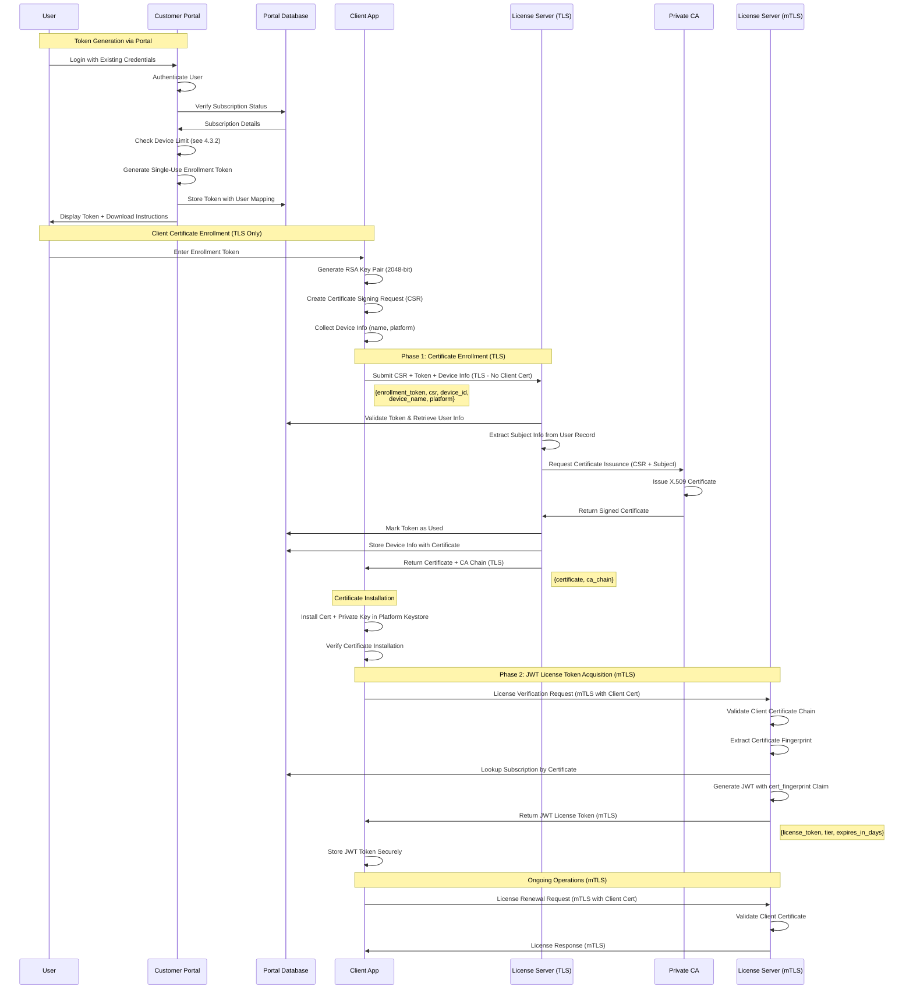
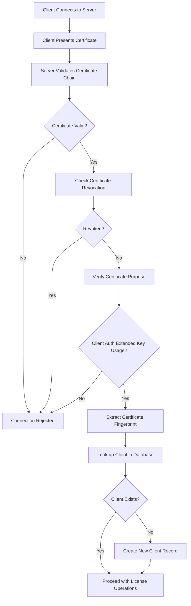
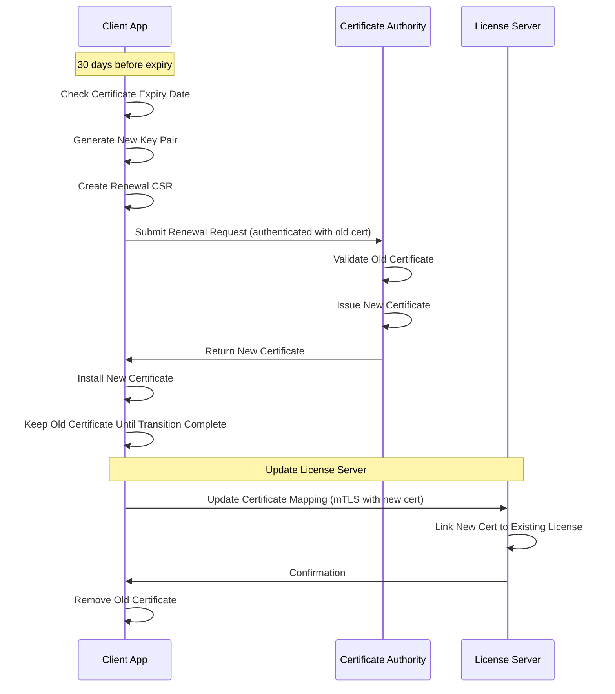
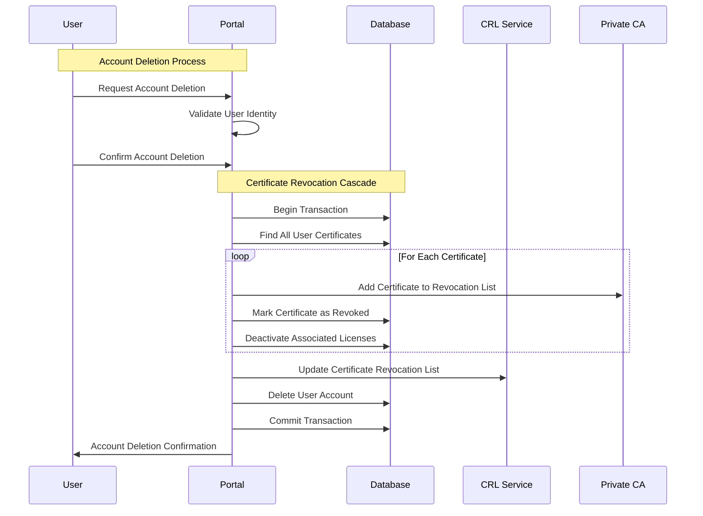
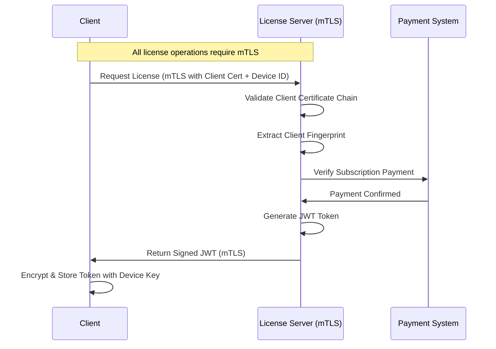
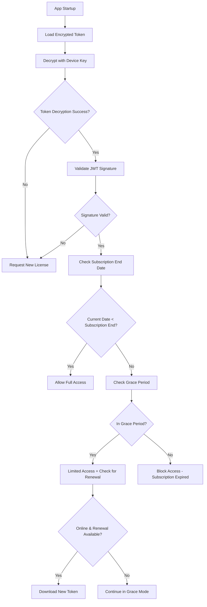
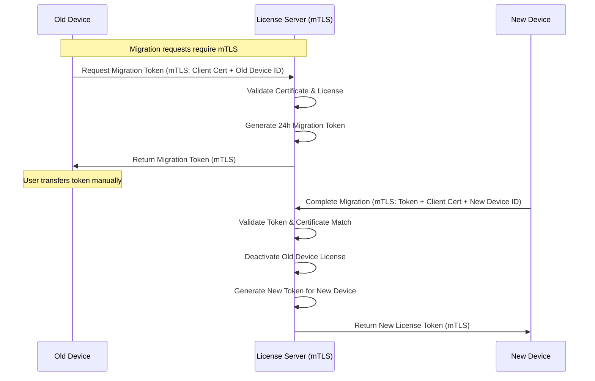

# Subscription Licensing System with Certificate Authentication - Design Document

## Table of Contents
1. [Executive Summary](#1-executive-summary)
2. [System Architecture](#2-system-architecture)
3. [Security Model](#3-security-model)
4. [Client Certificate Workflows](#4-client-certificate-workflows)
5. [Device Identification](#5-device-identification)
6. [License Management Workflow](#6-license-management-workflow)
7. [License Migration System](#7-license-migration-system)
8. [Server Implementation](#8-server-implementation)
9. [Client Implementation](#9-client-implementation)
10. [Security Considerations](#10-security-considerations)
11. [Operational Considerations](#11-operational-considerations)
12. [Future Enhancements](#12-future-enhancements)

---

## 1. Executive Summary

This document outlines the design for a subscription-based license management system that enables clients to operate offline for extended periods while maintaining security through certificate-based authentication and preventing casual license sharing.

The system uses a two-layer security architecture:
- **Certificate Layer:** X.509 certificates from a Private CA provide cryptographic identity
- **License Layer:** JWT tokens provide subscription management and feature entitlements

### 1.1 Key Features

- **Dual-layer authentication**: Certificate identity + license authorization
- **Subscription-based licensing**: Monthly and annual subscription models
- **Extended offline operation**: Full subscription period offline capability
- **Grace period support**: 5 days for monthly, 14 days for annual subscriptions
- **Multi-platform design**: Windows, macOS, and Linux (reference implementation provides macOS only)
- **License migration**: Secure device transfer for hardware upgrades
- **Private CA infrastructure**: Hierarchical certificate authority
- **Mutual authentication**: X.509 certificates for both client and server identity
- **Multi-device licensing**: Configurable device limits per subscription (1, 5, 10+ devices)
- **Device management**: Portal-based device enrollment tracking and revocation
- **Device identification**: User-provided device names and platform detection for easy identification

### 1.2 Architecture Overview

```
┌─────────────────────────────────────────────────────────────┐
│                   Certificate Layer                         │
│        (Certificate Provisioning & mTLS)                    │
│                                                             │
│  ┌──────────────┐         ┌──────────────┐                  │
│  │ Private CA   │         │ Client Cert  │                  │
│  │ - Root CA    │────────►│ Provisioning │                  │
│  │ - Inter. CA  │         │ - Web Token  │                  │
│  └──────────────┘         └──────────────┘                  │
└─────────────────────────────────────────────────────────────┘
                              │
                              │ Authenticated mTLS Channel
                              ▼
┌─────────────────────────────────────────────────────────────┐
│                   License Layer                             │
│         (Subscription & License Management)                 │
│                                                             │
│  ┌──────────────┐         ┌──────────────┐                  │
│  │ JWT License  │         │ Subscription │                  │
│  │ Tokens       │◄────────│ Management   │                  │
│  │ - Device ID  │         │ - Grace      │                  │
│  │ - Offline    │         │ - Migration  │                  │
│  └──────────────┘         └──────────────┘                  │
└─────────────────────────────────────────────────────────────┘

Client App                      License Server
┌─────────────────┐            ┌─────────────────┐
│ Certificate     │            │ Certificate     │
│ - From CA       │◄──mTLS────►│ Validation      │
│                 │            │ (Private CA)    │
├─────────────────┤            ├─────────────────┤
│ License Token   │            │ License Token   │
│ - JWT Storage   │◄───────────│ Issuance        │
│ - Device Bound  │            │ (Signed by      │
│ - Offline Valid │            │  Server Key)    │
└─────────────────┘            └─────────────────┘
```

### 1.3 Key Integration Points

**Certificate Provisioning (Phase 1 - TLS):**
1. User obtains enrollment token from web portal
2. Client generates CSR and submits via TLS with token
3. Private CA issues X.509 client certificate
4. Client receives certificate (PKCS#12 with private key)
5. Client stores certificate in platform-specific secure storage

**License Token Acquisition (Phase 2 - mTLS):**
6. Client performs mTLS authentication to license verification endpoint
7. Server validates client certificate chain and extracts identity
8. Server generates JWT license token bound to certificate fingerprint
9. Client receives and stores JWT token securely
10. Client can now perform offline license validation

**Ongoing Operations:**
1. Client uses mTLS with certificate for authentication
2. Server validates certificate AND license token status
3. License renewals delivered over mTLS channel
4. Client operates offline using cached license token

**Certificate Lifecycle → License Lifecycle:**
- Certificate valid for 2 years
- License token renewed monthly/annually
- Certificate renewal may trigger license token refresh
- Certificate revocation (account deletion) invalidates all license tokens

## 2. System Architecture

```
Client App                      License Server
┌─────────────────┐            ┌─────────────────┐
│ Certificate     │            │ Certificate     │
│ - From CA       │◄──mTLS────►│ Validation      │
│                 │            │ (Private CA)    │
├─────────────────┤            ├─────────────────┤
│ License Token   │            │ License Token   │
│ - JWT Storage   │◄───────────│ Issuance        │
│ - Device Bound  │            │ (Signed by      │
│ - Offline Valid │            │  Server Key)    │
└─────────────────┘            └─────────────────┘
```

## 3. Security Model

### 3.1 Layered Authentication Architecture

**Layer 1 - Certificate-Based Identity:**
- X.509 client certificates issued by Private CA
- Hierarchical CA: Root CA (offline) → Intermediate CA (online) → Client Certs
- Certificate validity: 2 years
- mTLS provides cryptographic authentication

**Layer 2 - License Token Authorization:**
- JWT tokens signed by server private key
- Contains subscription and entitlement information
- Device-bound for offline validation
- Shorter validity aligned with subscription periods (monthly/annual)

**Why Both Layers?**
- **Certificate Layer:** Proves client identity and authenticity
- **License Layer:** Proves subscription status and entitlements
- **Together:** Certificate authenticates WHO (identity), License authorizes WHAT (permissions)

### 3.2 Two-Phase Authentication Model

**Phase 1 - Certificate Enrollment (TLS Only):**
- Initial CSR submission uses standard TLS
- Client cannot use mTLS since they don't have a certificate yet
- Authentication relies on enrollment token validation
- Server validates enrollment token and issues certificate

**Phase 2 - License Operations (mTLS):**
- All subsequent operations require mutual TLS authentication
- Client presents X.509 certificate for authentication
- Server validates client certificate chain and identity
- Bidirectional authentication for all license management

**Security Rationale for Two-Phase JWT Delivery:**

The JWT license token is delivered via mTLS (Phase 2) rather than during enrollment (Phase 1) to provide critical security guarantees:

1. **X.509 Authentication for License Operations**
   - Enrollment tokens are single-use and relatively weak (UUID-based)
   - Certificate-based authentication is cryptographically strong
   - Client must prove private key possession (cannot be faked)

2. **Prevents Token Theft and Reuse**
   - If JWT was delivered during enrollment over plain TLS:
     - Network observers could capture the JWT in transit
     - JWT could be stolen before secure storage
     - Attackers could use JWT without possessing the certificate
   - With mTLS delivery:
     - Only legitimate certificate holders can request JWT
     - JWT bound to certificate fingerprint prevents misuse
     - Requires both certificate AND JWT for license operations

3. **Certificate-JWT Cryptographic Binding**
   - JWT contains `cert_fingerprint` claim (SHA-256 of client certificate)
   - Server validates: certificate fingerprint matches JWT claim
   - JWT is cryptographically useless without matching certificate
   - Creates defense-in-depth: enrollment token → certificate → JWT → license operations

4. **Separation of Concerns**
   - Phase 1: Identity provisioning (TLS) - "Here's your certificate"
   - Phase 2: License authorization (mTLS) - "Prove identity to get license"
   - Each phase requires stronger cryptographic proof than the previous

**Client Authentication:**
- X.509 client certificates issued by private CA
- Certificate fingerprint used as primary client identifier
- Private key possession required for all license operations (post-enrollment)

**Server Authentication:**
- X.509 server certificate issued by public CA
- Client validates server certificate during TLS handshake

### 3.3 License Token Format

**JWT Structure with Certificate Integration:**
```json
{
  "sub": "client-cert-fingerprint-sha256",
  "cert_serial": "certificate-serial-number",
  "device_id": "platform-specific-device-id", 
  "subscription_type": "monthly|annual",
  "subscription_id": "database-subscription-id",
  "subscription_end": 1640995200,
  "grace_period_end": 1641427200,
  "entitlements": {
    "features": ["premium", "analytics"],
    "max_users": 100
  },
  "payment_status": "active",
  "iat": 1640995200,
  "iss": "license-server.com"
}
```

**Certificate-License Binding:**
- `sub` field contains client certificate fingerprint
- `cert_serial` references the certificate serial number from CA database
- License token is cryptographically bound to specific certificate
- Server validates both certificate AND token on every request

**Token Security:**
- Signed with server's RSA private key (separate from CA keys)
- Client validates using embedded server public key
- Device-specific encryption using hardware keystore
- Cannot be decrypted on different devices

## 4. Client Certificate Workflows

### 4.1 Prerequisites and Setup

#### 4.1.1 CA Infrastructure Setup

**Root CA Initialization (Offline):**
```bash
# Generate Root CA private key (4096-bit RSA, AES-256 encrypted)
openssl genrsa -aes256 -out root-ca.key 4096

# Create Root CA certificate (20-year validity)
openssl req -new -x509 \
    -key root-ca.key \
    -days 7300 \
    -sha256 \
    -extensions v3_ca \
    -out root-ca.crt \
    -subj "/C=US/ST=State/L=City/O=Your Organization/OU=CA/CN=Root CA"
```

**Intermediate CA Setup (Online):**
```bash
# Generate Intermediate CA private key
openssl genrsa -aes256 -out intermediate-ca.key 4096

# Create CSR for Intermediate CA
openssl req -new -sha256 \
    -key intermediate-ca.key \
    -out intermediate-ca.csr \
    -subj "/C=US/ST=State/L=City/O=Your Organization/OU=CA/CN=Intermediate CA"

# Sign Intermediate CA certificate with Root CA (10-year validity)
openssl ca -config root-ca.cnf \
    -extensions v3_intermediate_ca \
    -days 3650 \
    -notext \
    -md sha256 \
    -in intermediate-ca.csr \
    -out intermediate-ca.crt

# Create certificate chain file
cat intermediate-ca.crt root-ca.crt > ca-chain.crt
```

**Client Certificate Issuance (2-year validity):**
```bash
# Issue client certificate from CSR
openssl ca -config intermediate-ca.cnf \
    -extensions client_cert \
    -days 730 \
    -notext \
    -md sha256 \
    -in client.csr \
    -out client.crt
```

#### 4.1.2 License Signing Keys Setup

**Separate from CA Keys:**
```bash
# Generate license signing private key (2048-bit RSA for JWT)
openssl genrsa -aes256 -out license-signing.key 2048

# Extract public key (embedded in client applications)
openssl rsa -in license-signing.key -pubout -out license-signing.pub
```

**Key Separation Rationale:**
- CA keys: Used for certificate issuance only
- License keys: Used for JWT signing only
- Compromised license key does NOT compromise CA infrastructure
- Allows independent key rotation schedules

---

### 4.2 Service Interfaces

#### 4.2.1 Enrollment Token Service Interface

**Token Generation:**
```php
interface IEnrollmentTokenService {
    /**
     * Generate single-use enrollment token for certificate provisioning 
     * Checks device limit before generating token. 
     * @param int $userId - User ID from portal session
     * @return array {token, expires_at, instructions, devices_enrolled, device_limit}
     * @throws NoActiveSubscriptionException
     * @throws DeviceLimitReachedException (includes list of enrolled devices)
     * @throws RateLimitException (max 5 tokens/24h)
     */
    public function generateEnrollmentToken(int $userId): array;
    
    /**
     * Validate enrollment token and return user context
     * @param string $token - Token submitted by client
     * @return array User and subscription details
     * @throws InvalidTokenException if token invalid/expired/used
     */
    public function validateToken(string $token): array;
    
    /**
     * Mark token as used after certificate issuance
     * @param string $token
     * @param string $certificateFingerprint - SHA256 of issued cert
     */
    public function markTokenUsed(string $token, string $certificateFingerprint): void;
}
```

**Device Limit Exception:**
```php
class DeviceLimitReachedException extends Exception {
    /**
     * @return array List of enrolled devices with identifying information
     * [{certificate_fingerprint, device_name, platform, enrolled_at, last_seen}]
     */
    public function getEnrolledDevices(): array;
}
```

#### 4.2.2 Private CA Service Interface

**Certificate Issuance:**
```php
interface IPrivateCAService {
    /**
     * Issue client certificate from CSR
     * @param string $csrPem - Certificate Signing Request in PEM format
     * @param string $subject - Distinguished Name (CN, O, OU)
     * @param array $options - Certificate options (keyUsage, validityPeriod)
     * @return string Certificate in PEM format
     */
    public function issueCertificate(
        string $csrPem, 
        string $subject, 
        array $options
    ): string;
    
    /**
     * Get CA certificate chain for client validation
     * @return array ['root_ca' => string, 'intermediate_ca' => string]
     */
    public function getCertificateChain(): array;
    
    /**
     * Revoke certificate (account deletion)
     * @param string $serialNumber - Certificate serial number
     * @param string $reason - Revocation reason
     * @param DateTime $revokedAt - Revocation timestamp
     */
    public function revokeCertificate(
        string $serialNumber,
        string $reason,
        DateTime $revokedAt
    ): void;
}
```

#### 4.2.3 Device Management Service Interface

**Device Management:**
```php
interface IDeviceManagementService {
    /**
     * List all enrolled devices for user
     * @param int $userId
     * @return array [{
     *   certificate_fingerprint,
     *   certificate_serial,
     *   device_name,
     *   platform,
     *   enrolled_at,
     *   last_seen,
     *   status: 'active'|'revoked'
     * }]
     */
    public function listUserDevices(int $userId): array;
    
    /**
     * Revoke specific device certificate
     * @param int $userId
     * @param string $certificateFingerprint
     * @throws UnauthorizedException if cert doesn't belong to user
     */
    public function revokeDevice(int $userId, string $certificateFingerprint): void;
}
```

---

### 4.3 Certificate Enrollment Workflow

#### 4.3.1 Certificate Enrollment Process

**Portal-Based Token Distribution:**
The certificate enrollment process uses an existing customer portal for secure token generation, followed by a two-phase authentication model. See section 4.3.2 for device limit enforcement during enrollment.



#### 4.3.2 Device Limit Enforcement

**Enrollment Token Generation Behavior:**

When a user requests a new enrollment token, the system checks if the user has reached their subscription's device limit. If at limit, enrollment is blocked until the user revokes an existing device certificate via the portal.

**Flow:**
1. User authenticates to portal
2. User requests new enrollment token
3. System counts active certificates for user
4. If count < device_limit: Generate enrollment token
5. If count >= device_limit: Throw `DeviceLimitReachedException` with list of enrolled devices
6. User must manually revoke a device via portal before proceeding

**Device Identification:**

During enrollment, clients provide device name and platform for user identification of devices in portal. This allows users to easily identify which device to revoke when at the device limit.

**Client submits during enrollment:**
```json
{
  "enrollment_token": "...",
  "csr": "...",
  "device_id": "device_abc123...",
  "device_name": "John's MacBook Pro",
  "platform": "macos"
}
```

**Server returns:**
```json
{
  "certificate": "...",
  "ca_chain": "...",
  "license_token": "...",
  "subscription_info": {
    "devices_enrolled": 2,
    "device_limit": 5
  }
}
```

**Attack Mitigation:**
- Device limits prevent unlimited certificate sharing
- Revocation is manual and explicit, requiring portal authentication
- Each device has user-friendly identification (name + platform)
- Revoked certificates added to CRL immediately

#### 4.3.3 Certificate Storage Strategy

**Platform-Specific Secure Storage:**

**Windows:**
- Primary: Windows Certificate Store (`certmgr.msc`)
- Location: `Current User\Personal\Certificates`
- Access: Windows CryptoAPI
- Private key: Non-exportable, hardware-backed if TPM available

**macOS:**
- Primary: Keychain Services (`login.keychain`)
- Access: `security` command-line tool or Security.framework
- Private key: Access Control Lists (ACL), Touch ID integration possible
- Attributes: `kSecAttrAccessibleWhenUnlockedThisDeviceOnly`

**Linux:**
- Primary: Encrypted file storage in `~/.config/app-name/certificates/`
- Encryption: AES-256 with key derived from user credentials
- Permissions: `chmod 600` (owner read/write only)
- Optional: Integration with GNOME Keyring or KWallet

---

### 4.4 Certificate Lifecycle Management

#### 4.4.1 Certificate Validation Workflow



**Validation Steps:**
1. Validate certificate chain against CA certificate
2. Check certificate not expired
3. Check certificate not revoked (CRL)
4. Verify Extended Key Usage includes Client Authentication
5. Extract certificate fingerprint (SHA-256)
6. Link certificate to user account in database

#### 4.4.2 Certificate Renewal Process



**Renewal Timeline:**
- Renewal window: 30 days before expiry
- Grace period: 7 days post-expiry before blocking access
- Email notifications: 60, 30, and 7 days before expiry
- Automated renewal for clients online during renewal window

**Certificate Transition:**
1. Client detects certificate expiring within 30 days
2. Generate new key pair and CSR
3. Submit renewal request via mTLS (authenticated with old cert)
4. Server validates old certificate and issues new certificate
5. Client installs new certificate alongside old
6. Client updates license server mapping
7. Client removes old certificate after successful verification

#### 4.4.3 Certificate Revocation Handling

**Account-Driven Revocation:**
Certificate revocation occurs only when a user deletes their account from the customer portal.



**CRL Distribution:**
- Update CRL every 24 hours
- Publish to web-accessible endpoint: `https://license-server.com/crl/current.crl`
- Include in certificate AIA extension
- Cache-Control headers: max-age=86400 (24 hours)

**Revocation Events:**
- Account deletion by user
- Account termination by administrator
- Certificate compromise report
- Subscription fraud detection

**Lost Device Recovery:**

When device is lost/stolen:
1. User logs into portal
2. Views list of enrolled devices (see 4.2.3)
3. Revokes the lost device certificate
4. Generates new enrollment token for replacement device
5. Enrolls replacement device

**Device limit enforcement:**
- If at device limit: Must revoke before enrolling new device
- If under limit: Can enroll additional device directly


## 5. Device Identification

### 5.1 Device ID Strategy

Device identification must be:
- **Stable**: Survives OS updates and minor hardware changes
- **Unique**: Different for each physical machine
- **Accessible**: Obtainable without admin privileges
- **Platform-native**: Uses OS-provided identifiers

### 5.2 Platform-Specific Device ID Sources

**Windows:**
- **Primary**: `HKEY_LOCAL_MACHINE\SOFTWARE\Microsoft\Cryptography\MachineGuid`
  - Stable across OS reinstalls if same hardware
  - Generated during Windows installation
  - Accessible without admin rights
- **Fallback**: Motherboard serial + CPU ID hash
  - Use WMI queries: `Win32_BaseBoard.SerialNumber` + `Win32_Processor.ProcessorId`
  - More stable than MAC addresses (network cards replaceable)

**macOS:**
- **Primary**: Hardware UUID from `system_profiler SPHardwareDataType`
  - Tied to logic board
  - Stable across OS reinstalls
  - Command: `system_profiler SPHardwareDataType | grep 'Hardware UUID'`
- **Fallback**: System serial number from `ioreg`
  - Command: `ioreg -l | grep IOPlatformSerialNumber`

**Linux:**
- **Primary**: `/etc/machine-id` or `/var/lib/dbus/machine-id`
  - Generated during system installation
  - Persistent across reboots
  - systemd standard
- **Fallback**: DMI product UUID from `/sys/class/dmi/id/product_uuid`
  - Requires root access in some distributions
  - Hardware-based identifier

### 5.3 Device ID Generation Algorithm

```
1. Attempt to read primary platform identifier
2. If unavailable, attempt fallback identifier
3. If both fail, generate error (do not create random ID)
4. Hash identifier with SHA-256
5. Prefix with "device_" for namespacing
6. Result format: "device_" + 64-character hex string
```

**Example Output:**
```
device_a3c7f8e9d2b4c1a5f6e8d9c7b4a3e2f1a5c6d7e8f9a1b2c3d4e5f6a7b8c9d0e1f2
```

### 5.4 Device ID Client Implementation Strategy

**Interface Design:**
```java
public interface IDeviceIdentifier {
    /**
     * Generate stable device identifier for current platform
     * @return String Device ID in format "device_{sha256_hash}"
     * @throws DeviceIdException if identifier cannot be determined
     */
    String generateDeviceId() throws DeviceIdException;
    
    /**
     * Get raw platform identifier (for debugging)
     * @return String Platform-specific identifier before hashing
     */
    String getRawPlatformIdentifier();
}
```

**Platform Implementation Pattern:**
```java
public class DeviceIdentifierFactory {
    public static IDeviceIdentifier create() {
        String os = System.getProperty("os.name").toLowerCase();
        
        if (os.contains("win")) {
            return new WindowsDeviceIdentifier();
        } else if (os.contains("mac")) {
            return new MacOSDeviceIdentifier();
        } else if (os.contains("nix") || os.contains("nux")) {
            return new LinuxDeviceIdentifier();
        } else {
            throw new UnsupportedOperationException("Platform not supported: " + os);
        }
    }
}
```

**Each platform implementation provides:**
1. Primary ID acquisition method
2. Fallback ID acquisition method
3. SHA-256 hashing
4. Error handling for inaccessible identifiers

**Reference implementation for macOS available in ReferenceImplGuide.md**

### 5.5 Device ID Stability Considerations

**What Should NOT Change Device ID:**
- OS updates (major or minor)
- Software installations
- Network configuration changes
- Drive upgrades (if primary identifier is hardware-based)
- RAM upgrades
- User account changes

**What WILL Change Device ID:**
- Motherboard replacement
- Logic board replacement (macOS)
- Complete OS reinstall with machine-id regeneration (Linux)
- Registry MachineGuid regeneration (Windows - rare)

**Migration Use Case:**
When device ID must change (hardware upgrade), use the license migration system (Section 7) to transfer license to new device.

## 6. License Management Workflow

### 6.1 Initial License Activation



### 6.2 License Token Service Interface

**Token Generation and Management:**
```php
interface ILicenseTokenService {
    /**
     * Generate initial JWT license token after enrollment
     * @param string $clientCertFingerprint - SHA256 of client certificate
     * @param string $certSerial - Certificate serial number
     * @param string $deviceId - Hardware device identifier
     * @param array $subscription - Subscription details from database
     * @return string JWT token (header.payload.signature)
     */
    public function generateInitialLicense(
        string $clientCertFingerprint,
        string $certSerial,
        string $deviceId,
        array $subscription
    ): string;
    
    /**
     * Generate refreshed license token
     * @param string $clientCertFingerprint
     * @param string $certSerial
     * @param string $deviceId
     * @param array $subscription - Updated subscription data
     * @return string JWT token
     */
    public function generateLicenseToken(
        string $clientCertFingerprint,
        string $certSerial,
        string $deviceId,
        array $subscription
    ): string;
    
    /**
     * Calculate grace period end date
     * @param string $subscriptionType - 'monthly' or 'annual'
     * @param DateTime $subscriptionEnd
     * @return DateTime Grace period end date
     */
    public function calculateGracePeriodEnd(
        string $subscriptionType,
        DateTime $subscriptionEnd
    ): DateTime;
}
```

**Grace Period Calculation:**
- Monthly subscription: `subscription_end + 5 days`
- Annual subscription: `subscription_end + 14 days`

### 6.3 Offline License Validation



### 6.4 License Renewal Service Interface

**Renewal Management:**
```php
interface ILicenseRenewalService {
    /**
     * Check for subscription renewal and issue new token
     * @param string $clientCertFingerprint - From mTLS connection
     * @param string $certSerial - Certificate serial number
     * @param string $deviceId - Hardware device identifier
     * @return array {
     *   status: 'renewed'|'grace_period'|'expired'|'no_subscription',
     *   token?: string,
     *   subscription_end?: datetime,
     *   grace_period_end?: datetime,
     *   message: string
     * }
     */
    public function checkForRenewal(
        string $clientCertFingerprint,
        string $certSerial,
        string $deviceId
    ): array;
}
```

### 6.5 Grace Period Behavior

**Monthly Subscriptions (5-day grace):**
- Days 1-5 after expiry: Full functionality with renewal attempts every 24 hours
- Background renewal checks every 6 hours when online
- Non-intrusive warnings about expired subscription

**Annual Subscriptions (14-day grace):**
- Days 1-14 after expiry: Full functionality with renewal attempts
- Less frequent renewal checks (daily) due to longer grace period
- Progressive warning escalation

## 7. License Migration System

### 7.1 Migration Workflow



### 7.2 Device Migration Service Interface

**Migration Token Management:**
```php
interface IDeviceMigrationService {
    /**
     * Initiate license migration from current device
     * @param string $clientCertFingerprint - From mTLS connection
     * @param string $certSerial - Certificate serial number
     * @param string $currentDeviceId - Device ID being migrated from
     * @return array {
     *   migration_token: string,
     *   expires_at: datetime,
     *   message: string
     * }
     * @throws InvalidLicenseException if no valid license found
     * @throws CertificateMismatchException if cert doesn't match license
     */
    public function initiateLicenseMigration(
        string $clientCertFingerprint,
        string $certSerial,
        string $currentDeviceId
    ): array;
    
    /**
     * Complete license migration to new device
     * @param string $migrationToken - Single-use migration token
     * @param string $clientCertFingerprint - From mTLS connection
     * @param string $certSerial - Certificate serial number
     * @param string $newDeviceId - Device ID for new device
     * @return string New JWT license token for new device
     * @throws InvalidMigrationTokenException if token invalid/expired
     * @throws CertificateMismatchException if cert doesn't match original
     */
    public function completeLicenseMigration(
        string $migrationToken,
        string $clientCertFingerprint,
        string $certSerial,
        string $newDeviceId
    ): string;
}
```

### 7.3 Migration Security

**Token Characteristics:**
- Single-use migration tokens
- 24-hour expiration window
- Bound to specific client certificate (validated via cert serial)
- Automatic cleanup after use or expiry

**User Experience:**
- Export: Generate migration code with clear instructions
- Import: Simple code entry on new device
- File-based transfer option for offline scenarios

**Migration Process Requirements:**
1. Same client certificate must be installed on new device
2. Old device license automatically deactivated upon completion
3. New device receives fresh license token bound to new device ID
4. Migration token cannot be reused

## Section 7.4 - Lost Device Recovery

**Replace existing content with:**

**When device is lost/stolen:**
1. User logs into portal
2. Views list of enrolled devices
3. Revokes the lost device certificate
4. Generates new enrollment token for replacement device
5. Enrolls replacement device

**Device limit enforcement:**
- If at device limit: Must revoke before enrolling new device
- If under limit: Can enroll additional device directly

## 8. Server Implementation

### 8.1 Core Service Interfaces

**Service Architecture:**

The server implementation integrates Private CA services with license management services. All services operate over HTTPS with dual authentication modes:
- **TLS-only**: Certificate enrollment endpoints (no client cert required yet)
- **mTLS**: All license operations (client cert required)

**Certificate Management Services:**
- `IPrivateCAService` - Issues certificates using Intermediate CA
- `IEnrollmentTokenService` - Manages web portal tokens
- `ICertificateValidator` - Validates client certificates via mTLS
- `ICRLService` - Manages Certificate Revocation Lists

**License Management Services:**
- `ILicenseTokenService` - Generates and validates JWT license tokens (mTLS)
- `ILicenseRenewalService` - Handles subscription renewals and grace periods (mTLS)
- `IDeviceMigrationService` - Manages secure license transfers between devices (mTLS)

### 8.2 Web Server Configuration

**Dual Authentication Endpoints:**

**Nginx Configuration Example:**
```nginx
# TLS-only endpoint for certificate enrollment
server {
    listen 443 ssl;
    server_name license-server.com;
    
    ssl_certificate /etc/ssl/certs/server.crt;
    ssl_certificate_key /etc/ssl/private/server.key;
    
    # No client certificate required
    location /api/certificate/enroll {
        ssl_verify_client off;
        proxy_pass http://php-backend;
    }
}

# mTLS endpoint for license operations
server {
    listen 9443 ssl;
    server_name license-server.com;
    
    ssl_certificate /etc/ssl/certs/server.crt;
    ssl_certificate_key /etc/ssl/private/server.key;
    
    # Require and verify client certificate
    ssl_verify_client on;
    ssl_client_certificate /etc/ca/ca-chain.crt;
    ssl_verify_depth 2;
    
    location /api/license/ {
        # Pass certificate info to backend
        proxy_set_header SSL-Client-Cert $ssl_client_cert;
        proxy_set_header SSL-Client-Fingerprint $ssl_client_fingerprint;
        proxy_set_header SSL-Client-Verify $ssl_client_verify;
        proxy_pass http://php-backend;
    }
    
    location /api/migration/ {
        proxy_set_header SSL-Client-Cert $ssl_client_cert;
        proxy_set_header SSL-Client-Fingerprint $ssl_client_fingerprint;
        proxy_pass http://php-backend;
    }
}
```

### 8.3 Database Schema

**Users and Subscriptions:**
```sql
CREATE TABLE users (
    id INT AUTO_INCREMENT PRIMARY KEY,
    email VARCHAR(255) UNIQUE NOT NULL,
    full_name VARCHAR(255) NOT NULL,
    organization VARCHAR(255),
    password_hash VARCHAR(255) NOT NULL,
    status ENUM('active', 'suspended', 'deleted') DEFAULT 'active',
    created_at TIMESTAMP DEFAULT CURRENT_TIMESTAMP,
    updated_at TIMESTAMP DEFAULT CURRENT_TIMESTAMP ON UPDATE CURRENT_TIMESTAMP,
    deleted_at TIMESTAMP NULL,
    INDEX idx_email (email),
    INDEX idx_status (status)
) ENGINE=InnoDB DEFAULT CHARSET=utf8mb4 COLLATE=utf8mb4_unicode_ci;

CREATE TABLE subscriptions (
    id INT AUTO_INCREMENT PRIMARY KEY,
    user_id INT NOT NULL,
    subscription_type ENUM('monthly', 'annual') NOT NULL,
    device_limit INT NOT NULL DEFAULT 1,
    start_date DATETIME NOT NULL,
    end_date DATETIME NOT NULL,
    payment_status ENUM('active', 'pending', 'expired', 'cancelled') DEFAULT 'pending',
    payment_provider VARCHAR(50),
    payment_provider_id VARCHAR(255),
    auto_renew BOOLEAN DEFAULT TRUE,
    created_at TIMESTAMP DEFAULT CURRENT_TIMESTAMP,
    updated_at TIMESTAMP DEFAULT CURRENT_TIMESTAMP ON UPDATE CURRENT_TIMESTAMP,
    INDEX idx_user_id (user_id),
    INDEX idx_end_date (end_date),
    INDEX idx_payment_status (payment_status),
    FOREIGN KEY (user_id) REFERENCES users(id) ON DELETE CASCADE
) ENGINE=InnoDB DEFAULT CHARSET=utf8mb4 COLLATE=utf8mb4_unicode_ci;
```

**Enrollment Tokens:**
```sql
CREATE TABLE enrollment_tokens (
    id INT AUTO_INCREMENT PRIMARY KEY,
    token VARCHAR(255) UNIQUE NOT NULL,
    user_id INT NOT NULL,
    subscriber_email VARCHAR(255) NOT NULL,
    subscriber_name VARCHAR(255) NOT NULL,
    organization VARCHAR(255),
    subscription_type ENUM('monthly', 'annual') NOT NULL,
    subscription_id INT NOT NULL,
    expires_at DATETIME NOT NULL,
    max_uses INT DEFAULT 1,
    used_count INT DEFAULT 0,
    used_at TIMESTAMP NULL,
    certificate_fingerprint VARCHAR(255),
    revoked_at TIMESTAMP NULL,
    created_at TIMESTAMP DEFAULT CURRENT_TIMESTAMP,
    INDEX idx_token (token),
    INDEX idx_user_id (user_id),
    INDEX idx_expires (expires_at),
    INDEX idx_subscription_id (subscription_id),
    FOREIGN KEY (user_id) REFERENCES users(id),
    FOREIGN KEY (subscription_id) REFERENCES subscriptions(id)
) ENGINE=InnoDB DEFAULT CHARSET=utf8mb4 COLLATE=utf8mb4_unicode_ci;
```

**Certificates:**
```sql
CREATE TABLE issued_certificates (
    id INT AUTO_INCREMENT PRIMARY KEY,
    serial_number VARCHAR(255) UNIQUE NOT NULL,
    subject VARCHAR(500) NOT NULL,
    fingerprint VARCHAR(255) UNIQUE NOT NULL,
    user_id INT NOT NULL,
    issued_at DATETIME NOT NULL,
    expires_at DATETIME NOT NULL,
    status ENUM('active', 'revoked', 'expired') DEFAULT 'active',
    revoked_at TIMESTAMP NULL,
    revocation_reason ENUM('account_deletion', 'key_compromise', 'superseded') NULL,
    created_at TIMESTAMP DEFAULT CURRENT_TIMESTAMP,
    INDEX idx_serial (serial_number),
    INDEX idx_fingerprint (fingerprint),
    INDEX idx_user_id (user_id),
    INDEX idx_status_expires (status, expires_at),
    FOREIGN KEY (user_id) REFERENCES users(id) ON DELETE CASCADE
) ENGINE=InnoDB DEFAULT CHARSET=utf8mb4 COLLATE=utf8mb4_unicode_ci;

CREATE TABLE clients (
    id INT AUTO_INCREMENT PRIMARY KEY,
    client_cert_fingerprint VARCHAR(255) UNIQUE NOT NULL,
    cert_serial_number VARCHAR(255) NOT NULL,
    user_id INT NOT NULL,
    subscriber_email VARCHAR(255) NOT NULL,
    subscriber_name VARCHAR(255) NOT NULL,
    organization VARCHAR(255),
    device_name VARCHAR(255),
    platform ENUM('windows', 'macos', 'linux', 'other') NOT NULL,
    enrollment_token VARCHAR(255),
    subscription_id INT NOT NULL,
    created_at TIMESTAMP DEFAULT CURRENT_TIMESTAMP,
    last_seen TIMESTAMP NULL,
    INDEX idx_fingerprint (client_cert_fingerprint),
    INDEX idx_cert_serial (cert_serial_number),
    INDEX idx_user_id (user_id),
    INDEX idx_subscription_id (subscription_id),
    FOREIGN KEY (enrollment_token) REFERENCES enrollment_tokens(token),
    FOREIGN KEY (cert_serial_number) REFERENCES issued_certificates(serial_number),
    FOREIGN KEY (user_id) REFERENCES users(id),
    FOREIGN KEY (subscription_id) REFERENCES subscriptions(id)
) ENGINE=InnoDB DEFAULT CHARSET=utf8mb4 COLLATE=utf8mb4_unicode_ci;
```

**Licenses:**
```sql
CREATE TABLE licenses (
    id INT AUTO_INCREMENT PRIMARY KEY,
    subscription_id INT NOT NULL,
    client_cert_fingerprint VARCHAR(255) NOT NULL,
    cert_serial_number VARCHAR(255) NOT NULL,
    device_id VARCHAR(255) NOT NULL,
    token TEXT,
    is_active BOOLEAN DEFAULT TRUE,
    created_at TIMESTAMP DEFAULT CURRENT_TIMESTAMP,
    updated_at TIMESTAMP DEFAULT CURRENT_TIMESTAMP ON UPDATE CURRENT_TIMESTAMP,
    deactivated_at TIMESTAMP NULL,
    FOREIGN KEY (subscription_id) REFERENCES subscriptions(id),
    FOREIGN KEY (cert_serial_number) REFERENCES issued_certificates(serial_number),
    INDEX idx_cert_device (client_cert_fingerprint, device_id),
    INDEX idx_cert_serial (cert_serial_number),
    INDEX idx_device_active (device_id, is_active)
) ENGINE=InnoDB DEFAULT CHARSET=utf8mb4 COLLATE=utf8mb4_unicode_ci;

CREATE TABLE license_migrations (
    id INT AUTO_INCREMENT PRIMARY KEY,
    migration_token VARCHAR(255) UNIQUE NOT NULL,
    client_cert_fingerprint VARCHAR(255) NOT NULL,
    cert_serial_number VARCHAR(255) NOT NULL,
    old_device_id VARCHAR(255) NOT NULL,
    expires_at DATETIME NOT NULL,
    created_at TIMESTAMP DEFAULT CURRENT_TIMESTAMP,
    INDEX idx_token (migration_token),
    INDEX idx_expires (expires_at),
    INDEX idx_cert_serial (cert_serial_number),
    FOREIGN KEY (cert_serial_number) REFERENCES issued_certificates(serial_number)
) ENGINE=InnoDB DEFAULT CHARSET=utf8mb4 COLLATE=utf8mb4_unicode_ci;
```

### 8.4 Key Database Design Points

- **Certificate-License Binding**: `cert_serial_number` columns link license data to certificates
- **Cascade Deletion**: Certificate revocation cascades to all license tables
- **Device Binding**: License tokens cryptographically bound to certificate fingerprints
- **Migration Tracking**: Separate table tracks device transfers with audit trail
- **Subscription Status**: Payment status tracked independently from license validity

## 9. Client Implementation

### 9.1 Client Architecture

**Component Responsibilities:**

**CertificateManager:**
- Generate RSA key pairs
- Create Certificate Signing Requests (CSR)
- Store certificates in platform keystore
- Retrieve certificates and private keys
- Calculate certificate fingerprints

**DeviceIdentifier:**
- Detect current platform (Windows/macOS/Linux)
- Retrieve platform-specific hardware identifiers
- Generate stable, hashed device IDs
- Handle fallback identification strategies

**JWTValidator:**
- Parse JWT tokens
- Verify RSA signatures using embedded server public key
- Validate token claims (expiration, issuer, etc.)
- Check certificate-license binding

**LicenseStorage:**
- Encrypt license tokens with device-specific keys
- Store encrypted tokens securely
- Decrypt tokens for validation
- Platform-specific secure storage integration

**LicenseApiClient:**
- Configure HTTP client with mTLS
- Submit enrollment requests (TLS)
- Request license renewals (mTLS)
- Handle migration operations (mTLS)

**EnrollmentManager:**
- Coordinate enrollment workflow
- Generate key pairs and CSRs
- Submit enrollment requests
- Install certificates and initial license tokens

**LicenseManager:**
- Validate licenses offline
- Check subscription status and grace periods
- Trigger renewal attempts
- Manage license lifecycle

### 9.2 Multi-Platform Device Identification Implementation

**Platform Detection and Strategy Selection:**

```java
public interface IDeviceIdentifier {
    /**
     * Generate stable device identifier for current platform
     * @return String Device ID in format "device_{sha256_hash}"
     * @throws DeviceIdException if identifier cannot be determined
     */
    String generateDeviceId() throws DeviceIdException;
    
    /**
     * Get raw platform identifier (for debugging)
     * @return String Platform-specific identifier before hashing
     */
    String getRawPlatformIdentifier();
}

public class DeviceIdentifierFactory {
    public static IDeviceIdentifier create() {
        String os = System.getProperty("os.name").toLowerCase();
        
        if (os.contains("win")) {
            return new WindowsDeviceIdentifier();
        } else if (os.contains("mac")) {
            return new MacOSDeviceIdentifier();
        } else if (os.contains("nix") || os.contains("nux")) {
            return new LinuxDeviceIdentifier();
        } else {
            throw new UnsupportedOperationException("Platform not supported: " + os);
        }
    }
}
```

**Windows Implementation Strategy:**

```java
public class WindowsDeviceIdentifier implements IDeviceIdentifier {
    
    @Override
    public String generateDeviceId() throws DeviceIdException {
        String rawId = getRawPlatformIdentifier();
        return "device_" + sha256(rawId);
    }
    
    @Override
    public String getRawPlatformIdentifier() {
        // Primary: Windows MachineGuid from registry
        try {
            String machineGuid = getWindowsMachineGuid();
            if (machineGuid != null && !machineGuid.isEmpty()) {
                return machineGuid;
            }
        } catch (Exception e) {
            // Log and try fallback
        }
        
        // Fallback: Motherboard serial + CPU ID
        try {
            String motherboardSerial = getMotherboardSerial();
            String cpuId = getCpuId();
            
            if (motherboardSerial != null && cpuId != null) {
                return motherboardSerial + "-" + cpuId;
            }
        } catch (Exception e) {
            throw new DeviceIdException("Unable to determine device ID", e);
        }
        
        throw new DeviceIdException("No device identifier available");
    }
    
    /**
     * Read MachineGuid from Windows Registry
     * Registry path: HKEY_LOCAL_MACHINE\SOFTWARE\Microsoft\Cryptography\MachineGuid
     * 
     * Implementation approaches:
     * 1. Use JNA (Java Native Access) with advapi32.dll
     * 2. Execute: reg query "HKLM\SOFTWARE\Microsoft\Cryptography" /v MachineGuid
     * 3. Use Windows Registry API via JNI
     */
    private String getWindowsMachineGuid() throws IOException {
        // Example using command execution:
        ProcessBuilder pb = new ProcessBuilder(
            "reg", "query",
            "HKLM\\SOFTWARE\\Microsoft\\Cryptography",
            "/v", "MachineGuid"
        );
        
        Process process = pb.start();
        // Parse output to extract GUID value
        // Format: "MachineGuid    REG_SZ    {GUID}"
        
        // Return extracted GUID
        return extractGuidFromRegistryOutput(process.getInputStream());
    }
    
    /**
     * Get motherboard serial using WMI
     * WMI Query: SELECT SerialNumber FROM Win32_BaseBoard
     */
    private String getMotherboardSerial() {
        // Implementation using WMI via command or JNA
        return executeWmiQuery("SELECT SerialNumber FROM Win32_BaseBoard");
    }
    
    /**
     * Get CPU ID using WMI
     * WMI Query: SELECT ProcessorId FROM Win32_Processor
     */
    private String getCpuId() {
        // Implementation using WMI via command or JNA
        return executeWmiQuery("SELECT ProcessorId FROM Win32_Processor");
    }
}
```

**macOS Implementation Strategy:**

```java
public class MacOSDeviceIdentifier implements IDeviceIdentifier {
    
    @Override
    public String generateDeviceId() throws DeviceIdException {
        String rawId = getRawPlatformIdentifier();
        return "device_" + sha256(rawId);
    }
    
    @Override
    public String getRawPlatformIdentifier() {
        // Primary: Hardware UUID
        try {
            String hardwareUuid = getMacOSHardwareUUID();
            if (hardwareUuid != null && !hardwareUuid.isEmpty()) {
                return hardwareUuid;
            }
        } catch (Exception e) {
            // Log and try fallback
        }
        
        // Fallback: System serial number
        try {
            String serialNumber = getMacOSSerialNumber();
            if (serialNumber != null && !serialNumber.isEmpty()) {
                return serialNumber;
            }
        } catch (Exception e) {
            throw new DeviceIdException("Unable to determine device ID", e);
        }
        
        throw new DeviceIdException("No device identifier available");
    }
    
    /**
     * Get Hardware UUID using system_profiler
     * Command: system_profiler SPHardwareDataType | grep 'Hardware UUID'
     * Output format: "Hardware UUID: XXXXXXXX-XXXX-XXXX-XXXX-XXXXXXXXXXXX"
     */
    private String getMacOSHardwareUUID() throws IOException, InterruptedException {
        ProcessBuilder pb = new ProcessBuilder(
            "/usr/sbin/system_profiler", "SPHardwareDataType"
        );
        
        Process process = pb.start();
        
        try (BufferedReader reader = new BufferedReader(
                new InputStreamReader(process.getInputStream()))) {
            
            String line;
            while ((line = reader.readLine()) != null) {
                if (line.contains("Hardware UUID:")) {
                    // Extract UUID after colon
                    String uuid = line.split(":")[1].trim();
                    return uuid;
                }
            }
        }
        
        process.waitFor();
        return null;
    }
    
    /**
     * Get system serial number using ioreg
     * Command: ioreg -l | grep IOPlatformSerialNumber
     * Output format: "IOPlatformSerialNumber" = "XXXXXXXXXXXX"
     */
    private String getMacOSSerialNumber() throws IOException, InterruptedException {
        ProcessBuilder pb = new ProcessBuilder("/usr/sbin/ioreg", "-l");
        
        Process process = pb.start();
        
        try (BufferedReader reader = new BufferedReader(
                new InputStreamReader(process.getInputStream()))) {
            
            String line;
            while ((line = reader.readLine()) != null) {
                if (line.contains("IOPlatformSerialNumber")) {
                    // Extract serial between quotes
                    String[] parts = line.split("=");
                    if (parts.length > 1) {
                        return parts[1].trim().replaceAll("\"", "");
                    }
                }
            }
        }
        
        process.waitFor();
        return null;
    }
}
```

**Linux Implementation Strategy:**

```java
public class LinuxDeviceIdentifier implements IDeviceIdentifier {
    
    @Override
    public String generateDeviceId() throws DeviceIdException {
        String rawId = getRawPlatformIdentifier();
        return "device_" + sha256(rawId);
    }
    
    @Override
    public String getRawPlatformIdentifier() {
        // Primary: machine-id
        try {
            String machineId = getLinuxMachineId();
            if (machineId != null && !machineId.isEmpty()) {
                return machineId;
            }
        } catch (Exception e) {
            // Log and try fallback
        }
        
        // Fallback: DMI product UUID
        try {
            String productUuid = getDmiProductUuid();
            if (productUuid != null && !productUuid.isEmpty()) {
                return productUuid;
            }
        } catch (Exception e) {
            throw new DeviceIdException("Unable to determine device ID", e);
        }
        
        throw new DeviceIdException("No device identifier available");
    }
    
    /**
     * Read machine-id from standard locations
     * Paths: /etc/machine-id or /var/lib/dbus/machine-id
     * 
     * This is the systemd machine ID, a 128-bit ID stored as 32 hex chars
     */
    private String getLinuxMachineId() throws IOException {
        // Try primary location
        Path primaryPath = Paths.get("/etc/machine-id");
        if (Files.exists(primaryPath)) {
            String machineId = Files.readString(primaryPath).trim();
            if (!machineId.isEmpty()) {
                return machineId;
            }
        }
        
        // Try fallback location
        Path fallbackPath = Paths.get("/var/lib/dbus/machine-id");
        if (Files.exists(fallbackPath)) {
            String machineId = Files.readString(fallbackPath).trim();
            if (!machineId.isEmpty()) {
                return machineId;
            }
        }
        
        return null;
    }
    
    /**
     * Read DMI product UUID from sysfs
     * Path: /sys/class/dmi/id/product_uuid
     * 
     * Note: May require root permissions on some distributions
     * Alternative: Use dmidecode command (also requires root)
     */
    private String getDmiProductUuid() throws IOException {
        Path uuidPath = Paths.get("/sys/class/dmi/id/product_uuid");
        
        if (Files.exists(uuidPath) && Files.isReadable(uuidPath)) {
            String uuid = Files.readString(uuidPath).trim();
            if (!uuid.isEmpty() && !uuid.equals("00000000-0000-0000-0000-000000000000")) {
                return uuid;
            }
        }
        
        // Alternative: Try dmidecode command
        // Requires: sudo dmidecode -s system-uuid
        // Or reading /proc/sys/kernel/random/boot_id as last resort
        
        return null;
    }
}
```

**Common Hashing Utility:**

```java
/**
 * SHA-256 hash implementation used by all platform identifiers
 */
private String sha256(String input) throws DeviceIdException {
    try {
        MessageDigest digest = MessageDigest.getInstance("SHA-256");
        byte[] hash = digest.digest(input.getBytes(StandardCharsets.UTF_8));
        
        // Convert to hex string
        StringBuilder hexString = new StringBuilder();
        for (byte b : hash) {
            String hex = Integer.toHexString(0xff & b);
            if (hex.length() == 1) {
                hexString.append('0');
            }
            hexString.append(hex);
        }
        
        return hexString.toString();
        
    } catch (NoSuchAlgorithmException e) {
        throw new DeviceIdException("SHA-256 algorithm not available", e);
    }
}
```

**Platform Integration Notes:**

**Windows:**
- Registry access requires no special permissions for MachineGuid
- WMI queries can be executed via command line or JNA
- Consider caching results to avoid repeated system calls

**macOS:**
- `system_profiler` and `ioreg` commands available on all macOS versions
- No special permissions required
- Hardware UUID is most stable across OS reinstalls

**Linux:**
- `/etc/machine-id` is standard on systemd-based distributions
- `/sys/class/dmi/id/product_uuid` may require root on some distros
- Consider distribution-specific variations

**Reference Implementation:**
Complete working implementation for macOS with JDK 25 features available in `ReferenceImplGuide.md`.

### 9.3 Certificate Management

**Certificate Storage Interface:**
```java
public interface ICertificateManager {
    /**
     * Generate RSA key pair for certificate enrollment
     * @return KeyPair with 2048-bit RSA keys
     */
    KeyPair generateKeyPair() throws CertificateException;
    
    /**
     * Create Certificate Signing Request
     * @param keyPair Generated key pair
     * @param commonName Subject common name
     * @param organization Subject organization
     * @return String CSR in PEM or JSON format
     */
    String generateCSR(KeyPair keyPair, String commonName, String organization) 
        throws CertificateException;
    
    /**
     * Store certificate and private key in platform keystore
     * @param cert X.509 certificate
     * @param privateKey Private key
     * @param label Friendly name for certificate
     */
    void storeCertificateInKeystore(X509Certificate cert, PrivateKey privateKey, String label)
        throws CertificateException;
    
    /**
     * Retrieve certificate from platform keystore
     * @param label Certificate label
     * @return X509Certificate or null if not found
     */
    X509Certificate getCertificateFromKeystore(String label) throws CertificateException;
    
    /**
     * Get private key from platform keystore
     * @param label Certificate label
     * @return PrivateKey or null if not found
     */
    PrivateKey getPrivateKeyFromKeystore(String label) throws CertificateException;
    
    /**
     * Calculate SHA-256 fingerprint of certificate
     * @param cert X.509 certificate
     * @return String Hex-encoded SHA-256 hash
     */
    String getCertificateFingerprint(X509Certificate cert) throws CertificateException;
}
```

### 9.4 License Validation Interface

**Offline License Validation:**
```java
public interface ILicenseManager {
    /**
     * Validate license token offline
     * @return LicenseStatus indicating current state
     */
    LicenseStatus validateLicense();
    
    /**
     * Attempt to renew license (requires network)
     * @param serverUrl License server URL
     * @return boolean True if renewal successful
     */
    boolean attemptRenewal(String serverUrl);
    
    /**
     * Get days remaining in subscription
     * @return int Days until expiration (negative if expired)
     */
    int getDaysRemaining();
    
    /**
     * Check if currently in grace period
     * @return boolean True if in grace period
     */
    boolean isInGracePeriod();
}

/**
 * License validation status
 */
public enum LicenseStatus {
    VALID,              // Active subscription
    GRACE_PERIOD,       // Expired but in grace period
    EXPIRED,            // Beyond grace period
    NOT_ACTIVATED,      // No license token found
    INVALID             // Token validation failed
}
```

### 9.5 Client Configuration

**Embedded Resources:**
```java
public class AppConfig {
    // License server URL
    public static final String LICENSE_SERVER_URL = 
        "https://license-server.com:8443";
    
    // Embedded CA certificate chain (PEM format)
    // Used to validate server certificate
    public static final String CA_CERTIFICATE_CHAIN = """
        -----BEGIN CERTIFICATE-----
        [Root CA Certificate]
        -----END CERTIFICATE-----
        -----BEGIN CERTIFICATE-----
        [Intermediate CA Certificate]
        -----END CERTIFICATE-----
        """;
    
    // Embedded license server public key (PEM format)
    // Used to validate JWT signatures
    public static final String LICENSE_SERVER_PUBLIC_KEY = """
        -----BEGIN PUBLIC KEY-----
        [RSA Public Key]
        -----END PUBLIC KEY-----
        """;
    
    // Renewal settings
    public static final int RENEWAL_CHECK_DAYS_BEFORE_EXPIRY = 7;
    public static final int RENEWAL_CHECK_INTERVAL_HOURS = 24;
    
    // Certificate settings
    public static final String CERTIFICATE_LABEL = "License Client Certificate";
    public static final int CERTIFICATE_KEY_SIZE = 2048;
}
```

## 10. Security Considerations

### 10.1 Layered Security Model

**Certificate Layer:**
- Hierarchical Private CA with offline Root CA
- 2-year certificate validity with renewal process
- Certificate revocation on account deletion only
- mTLS provides cryptographic authentication

**License Layer:**
- JWT tokens signed by separate server key (not CA key)
- Device-specific encryption prevents token transfer
- Subscription-period validity (monthly/annual)
- Grace period handling for payment delays

**Why Separate Certificate and License Tokens?**

1. **Different Purposes:**
   - Certificate: Proves client identity and authenticity
   - License: Proves subscription status and entitlements

2. **Different Lifecycles:**
   - Certificate: Long-lived (2 years), expensive to reissue
   - License: Short-lived (monthly/annual), easy to refresh

3. **Different Keys:**
   - Certificate: Signed by Private CA (Intermediate CA key)
   - License: Signed by license server (separate key)
   - Compromised license server key doesn't compromise CA

4. **Flexibility:**
   - Can update entitlements without reissuing certificates
   - Can handle subscription changes independently
   - Can implement different grace periods per subscription type

### 10.2 Anti-Piracy Measures

**Device Binding:**
- Hardware-backed device identification
- Encrypted token storage using device-specific keys
- Token unusable on different devices without migration
- Certificate-device-license triple binding

**Certificate-License Binding:**
- License tokens cryptographically bound to certificate fingerprint
- License tokens include certificate serial number
- Server validates certificate matches license on every request
- Cannot use license with different certificate

**Acceptable Trade-offs:**
- Focus on preventing casual sharing rather than determined attackers
- 30+ day offline periods require accepting some security compromises
- Emphasis on user experience for legitimate subscribers
- Migration process provides legitimate device transfer path

### Device Limit Enforcement

Subscriptions include a device limit (1, 2, 5, etc.). Users cannot enroll additional devices once limit is reached. Users must explicitly revoke existing device certificates via portal to free up slots.

**Device identification:** Users provide device name and platform during enrollment to identify devices in portal (e.g., "Work Laptop - Windows", "Home iMac - macOS"). Combined with enrollment date and last seen timestamp, this allows users to identify which device to revoke.

**Attack mitigation:** Device limits prevent unlimited sharing. Revocation is manual and explicit, requiring portal authentication. Revoked certificates added to CRL immediately.

### 10.3 Threat Mitigation

**Token Extraction:**
- Device-specific encryption makes tokens useless on other devices
- Requires both certificate private key AND device access
- Migration process provides legitimate transfer mechanism

**Certificate Sharing:**
- Client certificates secured by platform keystore
- Private key extraction requires significant technical skill
- License tokens add second layer of device binding
- Both certificate AND license must be compromised

**License Token Theft:**
- Even if JWT extracted, cannot decrypt without device key
- Cannot use with different certificate (fingerprint mismatch)
- Server validates certificate on every license operation
- Offline validation checks certificate-license binding

**Man-in-the-Middle Attacks:**
- mTLS provides mutual authentication
- Server certificate validated by embedded CA chain
- Client certificate validated by Private CA chain
- Cannot intercept without compromising both certificates

### 10.4 Key Management Security

**Separation of Keys:**
```
Private CA Keys (Certificate Issuance):
- Root CA Key: 4096-bit RSA, offline, 20-year validity
- Intermediate CA Key: 4096-bit RSA, online, 10-year validity

License Server Keys (JWT Signing):
- License Signing Key: 2048-bit RSA, online, annual rotation
- Separate from CA infrastructure
```

**Key Rotation:**
- License signing keys rotated annually
- Both old and new public keys embedded in client during transition
- 90-day overlap period for smooth transition
- Old key decommissioned after 180 days

**Compromise Impact:**
- Compromised license key: Cannot issue certificates, only fake licenses (requires valid cert)
- Compromised Intermediate CA: Can issue rogue certificates (Root CA remains secure)
- Compromised Root CA: Complete PKI compromise (kept offline to minimize risk)

## 11. Operational Considerations

### 11.1 Deployment Requirements

**Server Requirements:**
- PHP 8.1+ with OpenSSL extension
- MySQL 8.0+ or PostgreSQL 12+
- Web server (Apache 2.4+ or Nginx 1.18+) with dual TLS configuration:
  - TLS-only endpoints for certificate enrollment
  - mTLS endpoints for all license operations
- Two separate key pairs:
  - Private CA keys for certificate issuance
  - License server keys for JWT signing
- Private CA infrastructure:
  - Root CA (offline, 20-year validity)
  - Intermediate CA (online, 10-year validity)
  - Certificate storage and management

**Client Requirements:**
- Java 17+ (LTS) or Java 21+ (recommended) (reference implementation uses Java 25)
- Platform-specific secure storage:
  - Windows: Certificate Store access
  - macOS: Keychain Services access
  - Linux: File system with encryption capabilities
- Network connectivity for:
  - Initial enrollment
  - Periodic license renewal
  - Certificate renewal
  - License migration

**Deployment Options:**
- Traditional server deployment (PHP + MySQL + Apache/Nginx)
- Containerized deployment (Docker, Kubernetes)
- Cloud-native deployment (AWS, Azure, GCP)

### 11.2 Monitoring and Analytics

**Certificate Layer Monitoring:**
- CA health checks and certificate expiration tracking
- Certificate issuance rates and patterns
- CRL generation and distribution metrics
- Certificate renewal rates

**License Layer Monitoring:**
- License token issuance and renewal rates
- Grace period utilization patterns
- License migration frequency
- Subscription renewal success rates

**Combined Monitoring:**
- Certificate-license relationship health
- Certificate renewals vs license status
- Subscription churn relative to certificate lifecycle
- Grace period conversion rates

**Performance Metrics:**
- mTLS handshake success rates and latency
- Token refresh success rates
- Migration completion rates
- Certificate validation latency
- License validation latency

### 11.3 Backup and Disaster Recovery

**Critical Assets:**

**Root CA Private Key:**
- Most critical asset
- Stored offline on encrypted media
- Multiple encrypted backups in secure locations
- Access requires multi-person authorization
- Never connected to network

**Intermediate CA Private Key:**
- Online but heavily protected
- Encrypted at rest with strong passphrase
- Regular encrypted backups to secure storage
- HSM storage recommended for production

**License Signing Private Key:**
- Online for JWT signing operations
- Encrypted at rest
- Annual rotation reduces compromise window
- Backup before rotation

**Database:**
- Regular automated backups (daily minimum)
- Include all tables: users, subscriptions, certificates, licenses
- Test restoration procedures regularly
- Retention: 90 days minimum

**Recovery Procedures:**

**Intermediate CA Key Compromise:**
1. Revoke compromised Intermediate CA certificate
2. Generate new Intermediate CA key pair
3. Issue new Intermediate CA certificate from Root CA
4. Update server configuration
5. Reissue all active client certificates
6. Notify all clients to re-enroll

**License Signing Key Compromise:**
1. Generate new license signing key pair
2. Embed both old and new public keys in emergency client update
3. Deploy client update immediately
4. Switch to new key for signing
5. Revoke all existing license tokens (force renewal)
6. Decommission old key after transition

**Database Loss:**
1. Restore from most recent backup
2. Identify certificates issued since backup
3. Manual reconciliation with certificate logs
4. Force license renewal for affected users

### 11.4 Certificate Lifecycle Management

**Certificate Expiration Monitoring:**
- Automated checks for certificates expiring within 60 days
- Email notifications to users at 60, 30, and 7 days before expiry
- Grace period: 7 days post-expiry before blocking access
- Automated renewal process for clients online during renewal window

**Certificate Renewal Workflow:**
1. Client detects certificate expiring within 30 days
2. Generate new key pair and CSR
3. Submit renewal request via mTLS (authenticated with old cert)
4. Server validates old certificate and issues new certificate
5. Client installs new certificate alongside old
6. Client updates license server mapping
7. Client removes old certificate after successful verification

**CRL Distribution:**
- Update CRL every 24 hours
- Publish to web-accessible endpoint: `https://license-server.com/crl/current.crl`
- Include in certificate AIA extension
- Cache-Control headers: max-age=86400 (24 hours)

## 12. Future Enhancements

### 12.1 Potential Improvements

**Enhanced Security:**
- Hardware attestation (TPM 2.0, Secure Enclave) for device binding
- Code signing and integrity verification for client applications
- Remote license revocation capabilities (beyond account deletion)
- Certificate pinning for additional MITM protection
- OCSP stapling for real-time certificate validation

**User Experience:**
- Cloud-based license synchronization across multiple devices
- Family/team license sharing with sub-certificates
- Automatic device detection and setup wizard
- Streamlined certificate renewal (silent background renewal)
- Mobile device support (iOS, Android)

**Business Features:**
- Usage-based billing integration
- Feature-specific entitlements and metering
- Temporary license extensions and trial periods
- Multi-tier subscription management (Basic, Pro, Enterprise)
- Certificate-based SSO integration with corporate identity providers

**Platform Expansion:**
- Windows platform client implementation
- Linux platform client implementation
- Web-based license management dashboard
- API for third-party integrations
- Webhook notifications for license events

**Integration Enhancements:**
- Certificate rotation automation
- Automated CA intermediate certificate updates
- License token refresh during certificate renewal
- Unified certificate-license renewal flow
- Integration with payment providers (Stripe, PayPal)

**Operational Improvements:**
- HSM integration for CA key storage
- Multi-region license server deployment
- Load balancing and failover
- Advanced analytics and reporting
- Compliance reporting (SOC 2, ISO 27001)

---

## Appendix A: API Endpoints

### Portal Integration (Browser Access - Session Auth)
- `GET /portal/enrollment` - Show token generation page
- `POST /portal/enrollment/generate` - Generate enrollment token
- `DELETE /portal/enrollment/revoke` - Revoke unused token
- `GET /portal/enrollment/status` - Check token status
- `GET /portal/downloads` - Get client application downloads

### Account Management (Browser Access - Session Auth)
- `GET /portal/account/delete` - Show account deletion page
- `POST /portal/account/delete/confirm` - Confirm account deletion
- `GET /portal/account/certificates` - View user's certificates
- `GET /portal/account/licenses` - View user's active licenses

### Certificate Management (TLS Only - Token Auth)
- `POST /api/certificate/enroll` - Certificate enrollment with token + CSR
  - **Request:** `{enrollment_token, csr, device_id}`
  - **Response:** `{certificate, ca_chain, license_token, subscription_info}`
- `GET /api/certificate/status` - Check certificate validity
- `GET /api/crl/current` - Download current CRL

### License Management (mTLS Required - Certificate Auth)
- `POST /api/license/activate` - Initial license activation
  - **Auth:** Client certificate via mTLS
  - **Request:** `{device_id}`
  - **Response:** `{license_token, subscription_info}`
- `POST /api/license/renew` - Check for subscription renewal
  - **Auth:** Client certificate via mTLS
  - **Request:** `{device_id}`
  - **Response:** `{status, token?, subscription_end?, grace_period_end?, message}`
- `GET /api/license/status` - Current license status
  - **Auth:** Client certificate via mTLS
  - **Response:** `{status, subscription_type, subscription_end, grace_period_end, payment_status}`

### Migration (mTLS Required - Certificate Auth)
- `POST /api/license/migrate/initiate` - Start license migration
  - **Auth:** Client certificate via mTLS
  - **Request:** `{current_device_id}`
  - **Response:** `{migration_token, expires_at, message}`
- `POST /api/license/migrate/complete` - Complete migration
  - **Auth:** Client certificate via mTLS
  - **Request:** `{migration_token, new_device_id}`
  - **Response:** `{license_token, subscription_info}`

### Subscription Management (mTLS Required - Certificate Auth)
- `GET /api/subscription/status` - Current subscription details
  - **Auth:** Client certificate via mTLS
  - **Response:** `{subscription_type, start_date, end_date, payment_status, auto_renew}`

## Appendix B: Error Codes

| Code | Description | Action |
|------|-------------|---------|
| **Certificate Layer Errors** |
| 1001 | Invalid client certificate | Re-enroll certificate |
| 1007 | Certificate expired | Renew certificate |
| 1008 | Certificate revoked | Account deleted - contact support |
| 1009 | Invalid certificate chain | Check CA configuration |
| 1010 | Certificate enrollment failed | Verify identity and retry |
| 1011 | Invalid enrollment token | Check token validity and expiry |
| 1012 | Enrollment token expired | Request new token from portal |
| 1013 | Enrollment token already used | Request new token |
| 1014 | CSR validation failed | Generate new CSR with valid parameters |
| 1015 | Account deletion failed | Contact support |
| 1016 | Rate limit exceeded for enrollment tokens | Wait 24 hours or contact support |
| 1017 | No active subscription for enrollment | Verify subscription status in portal |
| 1018 | Device limit reached | Revoke an existing device in portal before enrolling new device |
| **License Layer Errors** |
| 2001 | License not activated | Activate license with valid subscription |
| 2002 | Subscription expired | Renew subscription |
| 2003 | Device not authorized | Migrate license or re-activate |
| 2004 | Invalid migration token | Generate new migration token |
| 2005 | Payment required | Update payment method |
| 2006 | Grace period expired | Renew subscription immediately |
| 2007 | License token invalid | Request new license token |
| 2008 | License-certificate mismatch | License bound to different certificate |
| 2009 | Device ID mismatch | License bound to different device |
| 2010 | Feature not entitled | Upgrade subscription plan |
| **Combined Errors** |
| 3001 | Certificate valid but no license | Complete license activation |
| 3002 | License valid but certificate expired | Renew certificate first |
| 3003 | Certificate-license binding broken | Re-activate license |

## Appendix C: Configuration Reference

### Server Environment Variables

```ini
# Application
APP_ENV=production
APP_DEBUG=false
APP_URL=https://license-server.com
APP_PORT=8443

# Database
DB_CONNECTION=mysql
DB_HOST=localhost
DB_PORT=3306
DB_DATABASE=license_system
DB_USERNAME=license_user
DB_PASSWORD=secure_password_here

# Private CA Configuration
CA_ROOT_CERT_PATH=/etc/ca/root-ca/root-ca.crt
CA_ROOT_KEY_PATH=/etc/ca/root-ca/root-ca.key
CA_ROOT_KEY_PASSWORD=root_ca_password_here

CA_INTERMEDIATE_CERT_PATH=/etc/ca/intermediate-ca/intermediate-ca.crt
CA_INTERMEDIATE_KEY_PATH=/etc/ca/intermediate-ca/intermediate-ca.key
CA_INTERMEDIATE_KEY_PASSWORD=intermediate_ca_password_here

CA_ISSUED_CERTS_DIR=/etc/ca/issued-certificates
CA_CRL_PATH=/var/www/html/public/crl/current.crl

# License Signing Keys (separate from CA keys)
LICENSE_SIGNING_KEY_PATH=/etc/license-server/license-signing.key
LICENSE_SIGNING_KEY_PASSWORD=license_key_password_here
LICENSE_SIGNING_PUB_PATH=/etc/license-server/license-signing.pub

# TLS Configuration
TLS_CERT_PATH=/etc/ssl/certs/server.crt
TLS_KEY_PATH=/etc/ssl/private/server.key

# Security
JWT_SECRET=random_secret_key_here
ENCRYPTION_KEY=32_byte_encryption_key_here

# Grace Periods (days)
GRACE_PERIOD_MONTHLY=5
GRACE_PERIOD_ANNUAL=14

# Certificate Validity
CERTIFICATE_VALIDITY_YEARS=2
CERTIFICATE_RENEWAL_DAYS=30

# Rate Limiting
RATE_LIMIT_ENROLLMENT=10
RATE_LIMIT_LICENSE=100
RATE_LIMIT_WINDOW=3600

# Logging
LOG_LEVEL=info
LOG_PATH=/var/log/license-server/app.log
AUDIT_LOG_PATH=/var/log/license-server/audit.log
```

### Client Configuration

```properties
# License Server
license.server.url=https://license-server.com:8443
license.server.verify.ssl=true

# Certificate Storage
cert.keychain.name=login
cert.keychain.label=License Client Certificate

# License Storage
license.storage.path=${user.home}/.config/license-client
license.storage.encrypted=true

# Renewal
license.renewal.check.days=7
license.renewal.check.interval.hours=24
license.renewal.background=true

# Migration
migration.token.validity.hours=24

# Logging
log.level=INFO
log.path=${user.home}/.local/share/license-client/logs
```

## Appendix D: Complete Workflow Examples

### New User Onboarding

**Step 1: Account Creation & Subscription (Portal)**
```
User → Portal: Sign up, purchase subscription
Portal → Database: Create user record, subscription record
Portal → User: Account confirmation email
```

**Step 2: Certificate Enrollment**
```
User → Portal: Login, navigate to enrollment page
Portal → Database: Generate enrollment_token
Portal → User: Display token + download instructions

User → Client App: Install app, enter token
Client → Client: Generate RSA key pair (2048-bit)
Client → Client: Create CSR
Client → Server (TLS): POST /api/certificate/enroll {token, csr, device_id}
Server → Private CA: Issue certificate (2-year validity)
Server → Database: Store certificate, mark token used
Server → License Service: Generate initial JWT license token
Server → Client (TLS): Return {certificate, ca_chain, license_token}
Client → Platform Keystore: Store certificate + private key
Client → Encrypted Storage: Store license token
```

**Step 3: First Application Launch**
```
Client → Certificate Manager: Load certificate from keystore
Client → License Manager: Load encrypted license token
Client → Validator: Validate certificate (expiry, chain)
Client → Validator: Validate license token
  - Verify JWT signature using embedded server public key
  - Check cert fingerprint matches token "sub" claim
  - Check cert serial matches token "cert_serial" claim
  - Check subscription_end date
Client → Application: Grant access to entitled features
```

### Monthly License Renewal

**Background Process (7 days before expiry)**
```
Client → Scheduler: Trigger renewal check
Client → Certificate Manager: Load certificate + private key
Client → HTTP Client: Configure mTLS with client certificate
Client → Server (mTLS): POST /api/license/renew {device_id}

Server → TLS Layer: Validate client certificate
Server → Certificate Validator: Check certificate not revoked
Server → Database: Extract cert fingerprint, lookup subscription
Server → Payment System: Verify payment received

IF payment received:
  Server → License Token Service: Generate new JWT
    - Same cert fingerprint
    - Same cert serial
    - Same device_id
    - New subscription_end date
    - New grace_period_end date
  Server → Database: Store new license token
  Server → Client (mTLS): Return {status: 'renewed', token: <new_jwt>}
  Client → Encrypted Storage: Store new license token
  Client → UI: Show "License renewed successfully"

IF payment NOT received (Grace Period):
  Server → Client (mTLS): Return {status: 'grace_period', grace_period_end, message}
  Client → License Manager: Continue using existing token
  Client → UI: Show "Payment pending - X days remaining in grace period"
  Client → Scheduler: Check again in 24 hours
```

### Device Migration (Hardware Upgrade)

**Step 1: Export on Old Device**
```
User → Old Client: Click "Migrate License to New Device"
Old Client → Certificate Manager: Load certificate
Old Client → Device ID: Get current device_id
Old Client → Server (mTLS): POST /api/license/migrate/initiate {current_device_id}

Server → Certificate Validator: Validate cert via mTLS
Server → Database: Verify active license for device_id
Server → Migration Service: Generate migration_token (24h expiry, single-use)
Server → Database: Store migration record
Server → Old Client (mTLS): Return {migration_token, expires_at}

Old Client → UI: Display migration token prominently
Old Client → UI: Show instructions: "Enter this token on your new device within 24 hours"
```

**Step 2: Import on New Device**
```
User → New Device: Install app
User → New Device: Install SAME client certificate (via backup/export)
User → New Client: Click "Import License from Another Device"
User → New Client: Enter migration token

New Client → Certificate Manager: Load certificate (must be same as old device)
New Client → Device ID: Get new device_id
New Client → Server (mTLS): POST /api/license/migrate/complete 
  {migration_token, new_device_id}

Server → Certificate Validator: Validate cert via mTLS
Server → Database: Lookup migration_token
Server → Validator: Check cert fingerprint matches original migration request
Server → Validator: Check cert serial matches original request
Server → Validator: Check token not expired
Server → Database: BEGIN TRANSACTION
  - Deactivate old device license (set is_active=false)
  - Create new license record for new_device_id
  - Generate new JWT license token for new device
  - Delete migration_token
Server → Database: COMMIT
Server → New Client (mTLS): Return {license_token, subscription_info}

New Client → Encrypted Storage: Store new license token
New Client → UI: Show "Migration successful! Your license is now active on this device."

Old Client (next startup): 
  → Attempt license validation
  → Server returns error 2003: Device not authorized
  → UI: Show "This license has been migrated to another device"
```

---

## Conclusion

This specification provides a comprehensive design for a production-ready subscription licensing system with certificate-based authentication. The system achieves:

**Security:**
- Strong cryptographic identity through Private CA infrastructure
- Flexible subscription management through JWT tokens
- Separation of CA and license signing keys prevents compromise propagation
- Defense in depth through layered authentication

**Operational Excellence:**
- Extended offline operation for full subscription periods
- Flexible subscription management without certificate reissuance
- Graceful handling of payment delays through grace periods
- Secure device migration for legitimate hardware upgrades

**User Experience:**
- Single enrollment process for both certificate and license
- Transparent authentication using certificates
- Clear grace period handling with user-friendly messaging
- Simple migration workflow for legitimate device transfers

**Platform Support:**
- Multi-platform design (Windows, macOS, Linux)
- Platform-specific secure storage integration
- Stable device identification across all platforms
- Reference implementation available for macOS

The system is designed for production deployment with comprehensive monitoring, clear operational procedures, and straightforward integration paths for future enhancements.

**Reference Implementation:**
Complete working code examples for Java client (macOS) and PHP server are available in `ReferenceImplGuide.md`, including:
- JDK 25 implementation with modern Java features
- Containerized server deployment
- Build scripts and packaging
- Testing examples
- Development environment setup